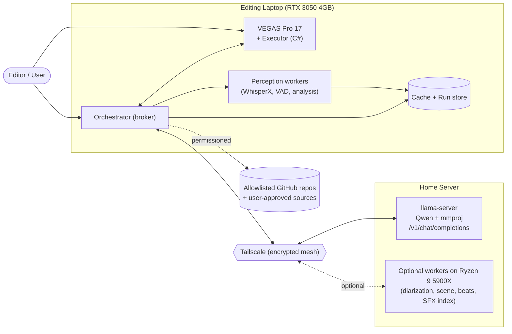
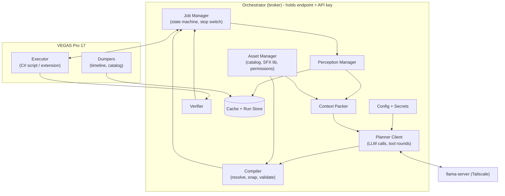
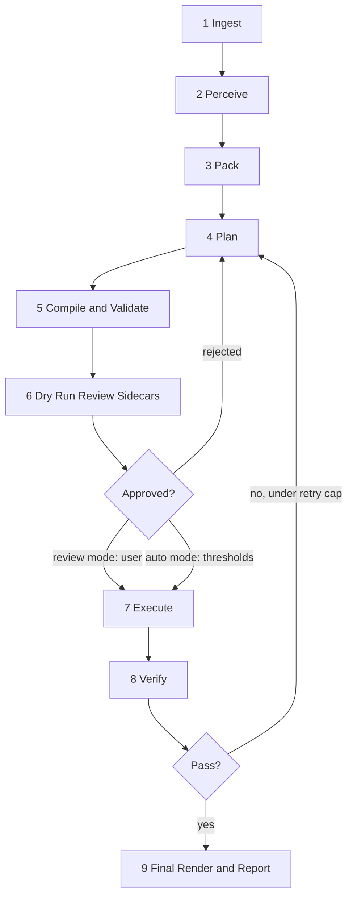

# ARCHITECTURE.md

**Project (working title):** Local AI Video Editing Agent for VEGAS Pro 17
**Document version:** 1.2.5
**Status:** M1 offline rough-cut and caption-sidecar implementation is complete for now as a prototype. The 120-second English smoke run reached verification using an approved 30 fps CFR working copy, produced timing anchors for 210/210 transcript rows, and applied eight baseline silence-gap actions. Verification reported 12 level-step and four pacing failures, so the run does not support an editing-quality claim. M1 does not execute Vegas. The offline job runner consumes supplied timeline, word, and speaker artifacts and exercises fakes; runtime assumptions remain open under RV-001, RV-007, and RV-008. Vegas-specific behaviors tagged `[UNVERIFIED]` must be confirmed on a throwaway Vegas Pro 17 project before code depends on them.

---

## Table of Contents

1. Purpose and Scope
2. Design Principles
3. Goals, Non-Goals, and Constraints
4. System Context
5. Deployment Topology and Hardware Allocation
6. Component Architecture
7. End-to-End Pipeline
8. Data Contracts
9. Perception Layer (ASR, Speakers, Audio and Visual Analysis)
10. Context Packing and the Planner (LLM)
11. The Compiler (Deterministic Timing and Validation)
12. The Vegas Executor
13. Subtitles and Speaker Colors
14. Transitions, Sound Effects, and Assets
15. Verification and Self-Correction
16. Security Model
17. Configuration
18. Caching, State, and Observability
19. Performance and Efficiency Strategy
20. Evaluation Strategy
21. Unverified Assumptions and Risks
22. Failure Modes and Handling
23. Repository Layout
24. Extension Points and Roadmap Hooks
25. Glossary

---

## 1. Purpose and Scope

This system edits talking-content videos (target length **4 to 15 minutes**) inside **MAGIX/Sony VEGAS Pro 17** using a **self-hosted LLM** (Qwen with a multimodal projector, served by `llama-server`) reached over **Tailscale**. It performs, with high timing precision:

- Content cuts (filler words, silences, retakes, dead air, false starts)
- Transitions chosen from what is actually installed in Vegas
- Sound effects chosen from a tagged local library
- Speaker-attributed subtitles with a **fixed color per speaker**
- Optional visual review of frames and optional requests for specific image or asset files

The user supplies **an endpoint URL and an API key**. No server-side code changes are required. The tool is a client of an OpenAI-compatible API.

The end state is a fully automated pipeline. Intermediate states keep a human in the loop through dry runs, review gates, and `ask_user` prompts.

**Out of scope for v1:** multi-cam sync, color grading, motion graphics authoring, live/streaming editing, non-Vegas NLEs (the compiler output is NLE-neutral so this stays possible later).

---

## 2. Design Principles

1. **The model decides intent. Code decides numbers.** The LLM references word IDs, segment IDs, speaker names, and catalog keys. It never emits raw timestamps, hex colors, file paths it invented, or plugin GUIDs. Code resolves IDs to frame-accurate times and applies styles.
2. **Closed vocabulary.** Every transition, effect, SFX, and style the model may select comes from a generated catalog. Anything outside the catalog is rejected at validation, not at execution.
3. **One plan per pass.** The planner emits a whole edit plan (an EDL) per video, not one action per turn. This minimizes round trips and keeps the system prompt prefix cacheable.
4. **Deterministic after the model.** Compile, validate, snap, execute, and verify are plain code with no model calls (except optional, bounded vision review).
5. **Broker isolation.** The API key and endpoint live only in the orchestrator. The Vegas executor and any content derived from media never see credentials.
6. **Untrusted inputs.** Transcripts, filenames, subtitle text, downloaded assets, and repo content are data. They are never treated as instructions to the agent.
7. **Reversible by default.** Work happens on a copy of the project. Every Vegas mutation batch is wrapped in an undo block. Source media is never modified or deleted.
8. **Precision first, speed second.** Where there is a tradeoff, choose the more accurate option. Speed is recovered through caching, batching, and single-pass planning.
9. **Cache everything expensive.** Transcripts, speaker attribution, and analysis are keyed by content hash and parameter set.
10. **Everything is a versioned contract.** Cross-component data is JSON with a schema and a version number.

---

## 3. Goals, Non-Goals, and Constraints

### Goals
- Cut accuracy: cuts land on word boundaries, in silence gaps, snapped to frames, with no audible clicks.
- Subtitle accuracy: text and timing derive from word timestamps, with sync error measured in milliseconds.
- Speaker fidelity: each subtitle line is attributed to one speaker and rendered in that speaker's color, in both multitrack and mixed-audio projects.
- Taste: output follows a user-supplied style guide with few-shot examples.
- Efficiency: single-pass planning, cached perception, minimal tokens.
- Safety: nothing destructive, everything undoable, credentials isolated.

### Non-Goals
- Replacing the human editor's creative authority on first runs. Early runs default to review mode.
- Real-time operation.
- Server-side modifications to `llama-server`.

### Constraints
- Vegas Pro 17 scripting API (C#/.NET, `ScriptPortal.Vegas` namespace). The API is old and sparsely documented.
- Vegas scripts run on the UI thread. Long operations block Vegas.
- Only OFX effects expose adjustable parameters through scripting. Non-OFX effects are limited to presets or defaults. `[UNVERIFIED on 17]`
- Editing laptop has an RTX 3050 with 4 GB VRAM. Inference server has a 16 GB VRAM GPU running a 27B Q4 model, so VRAM is tight there.
- Video lengths of 4 to 15 minutes keep the full transcript within a single context window.

---

## 4. System Context



External actors:
- **User:** starts jobs, reviews dry runs, answers `ask_user` prompts, approves non-allowlisted downloads.
- **llama-server:** only an inference endpoint. It holds no project state.
- **Asset sources:** allowlisted GitHub community repos load without prompting. Everything else asks first.

---

## 5. Deployment Topology and Hardware Allocation

### 5.1 Default topology: laptop-only perception (no server changes)

| Machine | Role | Runs |
| :-- | :-- | :-- |
| Editing laptop (RTX 3050, 4 GB) | Everything except inference | Vegas 17, executor, orchestrator, WhisperX (ASR plus word alignment), silence/VAD analysis, packing, compiler, verifier, cache |
| Inference server GPU (16 GB) | LLM only | `llama-server` with Qwen and mmproj |
| Inference server CPU (Ryzen 9 5900X) | Unused by default | Optional offload target, see 5.2 |

Rationale: the tool needs only an endpoint and API key, so the default path adds zero server-side setup.

Laptop sizing guidance `[BENCHMARK REQUIRED]`:
- WhisperX with a medium or distilled large model at int8 or int8_float16 is the starting point for 4 GB VRAM. Full large-v3 may not fit comfortably.
- Run diarization on CPU if VRAM is contended.
- Do not run ASR while Vegas is rendering or previewing heavily. The orchestrator serializes GPU-heavy stages.

### 5.2 Optional topology: offload to the 5900X

Enabled by a config flag. Offloadable stages, all CPU-friendly:
- Speaker diarization and voice-profile matching
- Silence, scene-change, beat, and loudness analysis
- Frame and filmstrip extraction
- SFX embedding and index building

Only compact artifacts cross the network: a 16 kHz mono WAV for audio stages, JPEG frames, and JSON results. Video files and the Vegas project never leave the laptop.

### 5.3 Inference server expectations (no code changes, launch flags only)

| Requirement | Detail |
| :-- | :-- |
| Multimodal | `llama-server` started with the matching `--mmproj` file. Confirmed available. |
| Context | At least 32k. Plan for 32 to 64k. A 15-minute transcript with speakers and silence data is expected to fit in roughly 15 to 25k tokens plus schema and catalog. 128k works but is slower, and is not needed for this video length. |
| VRAM | A 27B Q4 model plus the mmproj plus KV cache will be tight in 16 GB. Expect to tune KV-cache quantization and possibly partial CPU offload. `[TUNE]` |
| Structured output | Uses `/v1/chat/completions` with a JSON schema or grammar constraint. The client sends the schema with each request. `[VERIFY on target build]` |
| Auth | Bearer token from `--api-key`, supplied by the user in the orchestrator config. |
| Prefix caching | Keep the system prompt and catalog byte-stable between runs to benefit from prompt caching. |

### 5.4 Network

All laptop to server calls go over Tailscale with HTTPS. Payloads are text (transcript, catalog, EDL) and small JPEG frames. Nothing heavy crosses the link.

---

## 6. Component Architecture



### 6.1 Orchestrator
The long-running process the user starts. It is the **only** component that holds the endpoint URL and API key. Responsibilities: job state machine, scheduling GPU-heavy stages, calling the LLM, enforcing the permission policy, and mediating all communication with Vegas. Implementation target: Python 3.12 on Windows; the active environment and WhisperX compatibility decision are recorded in `DECISIONS.md` D-11.

### 6.2 Vegas Executor
A C# script or extension inside Vegas. It has no network access to the LLM and no knowledge of credentials. It does two things: (1) **dump** state (timeline and catalog) and (2) **apply** compiled operations. Details in Section 12.

### 6.3 Perception Manager
Runs ASR with word alignment, speaker attribution, and audio and visual analysis. Produces `words.json`, `analysis.json`, and optional frame artifacts. All results are cached by content hash.

### 6.4 Context Packer
Converts perception output and Vegas state into the compact text view the planner reads (Section 10).

### 6.5 Planner Client
Builds the request, sends it to the LLM with a JSON-schema constraint, handles bounded tool rounds (frame requests, asset requests), and returns a candidate EDL.

### 6.6 Compiler
Deterministic. Resolves IDs to times, snaps to frames and silence gaps, enforces editing rules, validates against the catalog and schema, and emits an executable operation list.

### 6.7 Asset Manager
Owns the catalog (from Vegas), the SFX library and its tags/embeddings, style assets, and the download permission policy.

### 6.8 Verifier
Renders a low-resolution preview, inspects each cut, transition, and subtitle, and returns a pass/fail report that can trigger a bounded fix loop.

---

## 7. End-to-End Pipeline



| # | Stage | Input | Output | Runs on |
| :-- | :-- | :-- | :-- | :-- |
| 1 | Ingest | Open Vegas project | `timeline.json`, `catalog.json` (once), media hashes, project copy | Vegas + orchestrator |
| 2 | Perceive | Media audio | `words.json`, `analysis.json`, optional frames | Laptop (or 5900X if enabled) |
| 3 | Pack | Words, analysis, timeline, speakers, catalog | `pack.txt` (compact planner view) | Orchestrator |
| 4 | Plan | Pack, schema, style guide, rules | `edl.json` (candidate) | LLM over Tailscale |
| 5 | Compile | `edl.json`, `words.json`, `timeline.json`, `catalog.json` | `ops.json` plus `compile_report.json` | Orchestrator |
| 6 | Dry run | `ops.json` | `markers.csv`, `cutlist_preview.edl`, and `review.md` | Orchestrator; no Vegas mutation |
| 7 | Execute | `ops.json` | Edited project copy | Vegas (undo-wrapped) |
| 8 | Verify | Edited project | `verify_report.json` | Vegas render plus orchestrator analysis |
| 9 | Final | Verified project | Final render, run manifest | Vegas |

### Stage notes

**1 Ingest.** Duplicate the `.veg` to a working copy before anything else. Dump the timeline (tracks, events, take info, frame rate, groups). Dump the catalog once per Vegas install, or when plugins change (hash the plugin list to detect that).

**2 Perceive.** See Section 9.

**3 Pack.** See Section 10.

**4 Plan.** One LLM call produces the EDL. Optional bounded tool rounds happen inside this stage (Section 10.4).

**5 Compile.** The model's intent becomes frame-accurate operations or the plan is rejected with specific errors fed back to the planner for a corrected pass (max retries configurable, default 2).

**6 Dry run.** The offline runner writes marker CSV, CMX3600 cutlist, and Markdown review sidecars; it does not write Vegas markers or mutate a Vegas project. Vegas marker/region APIs remain unverified under VQ-13. In review mode a human can inspect the sidecars before approval. The reference WAV is not a Vegas render.

**7 Execute.** Operations apply to the working copy inside a single undo block per batch.

**8 Verify.** See Section 15.

**9 Final.** Render using a configured Vegas render template and write the run manifest.

### Operating modes

| Mode | Behavior |
| :-- | :-- |
| `dry-run` | Produces stage 6 review sidecars only. Default for first use on any project. |
| `review` | Requires explicit per-item approval and an enabled executor adapter; current CLI executor fails closed pending E0 human checks. |
| `auto` | Executes without approval if all compile and confidence thresholds pass. Any `ask_user` still pauses. This is the end-state mode. |

---

## 8. Data Contracts

All contracts are JSON with a `schema_version`. Each has a prose spec in `docs/contracts/` and a machine-checkable JSON Schema in `schemas/`. Code and prompts derive from the same schema files.

### 8.1 ID conventions

| Prefix | Meaning | Example |
| :-- | :-- | :-- |
| `w` | Word | `w1042` |
| `s` | Segment (sentence or phrase unit) | `s87` |
| `g` | Silence/gap | `g31` |
| `e` | Vegas timeline event | `e12` |
| `sp` | Speaker | `mike` (name keys) |
| `fx`, `tr`, `sfx` | Catalog keys for effects, transitions, sound effects | `tr.crossfade-short.a1b2c3` |
| `sc` | Scene | `sc4` |

IDs are stable for a given `words.json` hash. If ASR is re-run, IDs may change and any saved EDL against the old hash is invalid.

### 8.2 `words.json` (perception output)

```json
{
  "schema_version": "2.1.0",
  "source_hash": "sha256:...",
  "fps": "30000/1001",
  "asr": {"engine": "whisperx", "model": "medium", "align_model": "wav2vec2", "params_hash": "..."},
  "speaker_mode": "multitrack | diarized | hybrid | single",
  "words": [
    {"id": "w1", "text": "So", "start": 1.240, "end": 1.410,
     "speaker": "mike", "speaker_conf": 0.97, "word_conf": 0.93, "track": "Mic 1", "overlap": false}
  ],
  "segments": [
    {"id": "s1", "word_ids": ["w1","w2","w3"], "speaker": "mike"}
  ],
  "gaps": [
    {"id": "g1", "start": 2.1, "end": 2.4}
  ],
  "audio_events": [
    {"type": "laughter", "start": 33.2, "end": 34.0}
  ]
}
```

Times in seconds from source media start. Compile converts to timeline time and frames.

### 8.3 speakers.json (user-maintained)

Schema version: 1.1.0. The document maps speaker keys to display labels, subtitle colors, optional audio-track aliases, and optional local voice-profile metadata. Track modes distinguish a single-speaker track from a mixed track. Embedding metadata records the model ID, dimension, sample rate, sample duration, and quality status, but never raw audio or credentials. Profile files stay under ignored voices/. The model sees only speaker keys, never colors or profile paths. See docs/contracts/speakers.md for bounds and validation.

### 8.4 `timeline.json` (synthetic in M1; Vegas dump later)

The [timeline contract](docs/contracts/timeline.md) represents the M1 source file as a rational-fps, integer-frame timeline with one video event, one audio event per selected audio stream, and one linked A/V group. Each event carries its source offset and length. A future Vegas dumper adds project metadata (track names and state, takes, ripple, markers, regions, and resolution) while preserving event, group, and frame semantics. M1 synthetic timeline data does not verify Vegas behavior.

### 8.5 `catalog.json` (closed vocabulary)

Generated by the Vegas dumper plus the SFX library index.

```json
{
  "schema_version": "1.0.0",
  "vegas_version": "17.x",
  "plugin_list_hash": "sha256:...",
  "transitions": [
    {"key": "tr.crossfade-short.a1b2c3", "kind": "transition",
     "plugin_unique_id": "{Svfx:...}", "is_ofx": true,
     "tags": ["soft","dialogue-safe"], "params_mode": "params",
     "default_duration_frames": 12, "params": {}}
  ],
  "video_fx": [],
  "audio_fx": [],
  "text_presets": [
    {"key": "txt.default.a1b2c3", "kind": "text_preset",
     "params_mode": "preset_only", "supports_color_override": "unknown", "presets": ["..."]}
  ],
  "sfx": [
    {"key": "sfx.whoosh-01.a1b2c3", "kind": "sfx", "path": "sfx/whoosh_01.wav",
     "tags": ["whoosh","transition"], "params_mode": "defaults_only",
     "duration": 0.6, "loudness_lufs": -18.0, "license": "CC0", "source": "local"}
  ]
}
```

Keys use `<category>.<normalized-name>.<uid-hash>`: lowercase names with punctuation normalized to hyphens, followed by a stable short hash of the plugin UID or asset identity. Every catalog entry has a `kind` and `params_mode`. Only keys present in the catalog are valid in an EDL. Plugin GUIDs and paths are internal to code and never shown in the model-facing derived catalog summary.

### 8.6 `edl.json` (planner output)

The single structured artifact the LLM emits. Illustrative shape:

```json
{
  "schema_version": "1.1.0",
  "words_hash": "sha256:...",
  "summary": "Tightened intro, removed 14 fillers and 3 retakes.",
  "cuts": [
    {"id": "c1", "remove": {"from_word": "w120", "to_word": "w141"},
     "reason": "false start, speaker restarts sentence", "confidence": 0.92, "category": "retake"}
  ],
  "gap_actions": [
    {"id":"c2", "gap_id":"g7", "mode":"shorten", "reason":"tighten long pause", "confidence":0.86, "category":"silence"}
  ],
  "keeps_reordered": [],
  "transitions": [
    {"at_cut": "c1", "offset_hint": "at", "type": "tr.crossfade-short.a1b2c3", "reason": "smooth audio join"}
  ],
  "sfx": [
    {"at_word": "w300", "offset_hint": "before", "key": "sfx.whoosh-01.deaf01", "gain_db": -12, "reason": "topic change"}
  ],
  "subtitles": {
    "style": "txt.default.a1b2c3",
    "emphasis": [{"word_ids": ["w512","w513"], "mode": "bold"}],
    "break_hints": [{"before_word": "w600"}],
    "omit_ranges": []
  },
  "tool_requests": [],
  "questions": []
}
```

Rules enforced by schema and compiler:
- No numeric timestamps from the model. References are IDs only. `offset_hint` is a small enum (`before`, `at`, `after`), resolved by code.
- `confidence` is required per cut and drives auto-mode gating.
- `questions` is the `ask_user` channel. A non-empty list pauses the job.
- The `keeps_reordered` array is empty-only in schema version 1.1.0. Positions can anchor to word, segment, gap, event, or cut IDs; event references are checked when timeline data is available.

### 8.7 `ops.json` (compiler output)

The executor contract is a header plus an ordered operation array discriminated by `op`. The header carries `job_id`, `working_copy_path`, rational `fps`, and `source_hashes`. The operation union is `add_marker`, `add_region`, `split`, `delete_range`, `close_gap`, `trim`, `set_fade`, `add_transition`, `add_audio_event`, `set_gain`, `apply_fx`, `add_text_event`, `set_text_style`, `render_preview`, `render_final`, `save_checkpoint`, and `clear_markers_by_prefix`, matching Section 8 of `docs/VEGAS_NOTES.md`. Resolved timeline positions are non-negative integer frames. Resolved colors, plugin IDs, and confined file paths may appear here because only the compiler produces this artifact. Every Vegas mechanism remains `[UNVERIFIED]` until the corresponding VQ question is settled.

### 8.8 Reports

- `compile_report.json`: removed frame totals and percentage, warnings, rejected items, and each snap (`id`, original word time, final integer frame, delta in milliseconds, and reason).
- `verify_report.json`: per-check thresholds and measurements, overall pass state, and machine-readable fix suggestions (Section 15).
- `run_manifest.json`: input IDs and hashes (no paths), contract/tool/model versions, per-stage wall-clock, token estimates, source hashes before and after, and the outcome (Section 18).

---

## 9. Perception Layer

### 9.1 Speech recognition and word timing
- **Engine:** WhisperX (faster-whisper backend plus wav2vec2 forced alignment) for word-level timestamps. Other engines may be swapped in behind the same interface if they emit `words.json`.
- **Audio prep:** extract 16 kHz mono WAV per source track.
- **Quality:** raw Whisper timestamps can drift by hundreds of milliseconds. Forced alignment is mandatory. The compiler additionally snaps cuts to detected silence gaps and zero-crossings, so residual error does not become an audible artifact.

### 9.2 Speaker attribution (mode selection and local interfaces)

Mode selection reads stream titles, Mic N / Track N aliases, and speakers.json track mappings. speakers.mode accepts auto, single, multitrack, diarized, or hybrid; the checked-in example keeps the existing single default. Explicit auto selects multitrack when every track maps to one speaker, hybrid for partial or mixed mappings, and diarized for an unmapped mixed stream.

Multitrack mode transcribes each audio stream separately, merges words by start time, and compares temporally overlapping duplicate tokens using per-track RMS energy. Diarized assignment uses word/turn time intersection, flags overlap, and lowers confidence. Each word keeps a speaker key or unknown_N, confidence, and optional track ID. Segments split at speaker or overlap changes.

The diarization and embedding interfaces have deterministic fixture coverage only. No accepted local model backend is configured, so diarized and hybrid runs stop with RV-005. The multitrack bleed heuristic and its thresholds are ASSUMED for real speech under RV-006. See the detailed speaker guide in docs/SPEAKERS.md.

### 9.3 Voice enrollment

The local enrollment helper checks duration, estimated SNR, and consistency between sample windows, then saves a normalized embedding and metadata under ignored voices/. Synthetic fake-encoder tests cover those checks. The CLI currently stops because the accepted local encoder is unavailable; real enrollment and model matching remain ASSUMED under RV-005 and RV-006. No token or model weights were read or downloaded for this goal.

### 9.4 Audio analysis (`analysis.json`)
- Silence/gap map with precise bounds and noise-floor-relative thresholds
- Loudness curve (short-term LUFS) for gain and SFX leveling decisions
- Beat or onset markers if music is present
- Audio events (laughter, applause) where the ASR or a classifier provides them
- Scene-change timestamps from video analysis for visual-aware decisions

### 9.5 Visual analysis (on demand)
Frames and filmstrips are produced **only when requested** (by the verifier or by planner tool rounds), not for every frame. This keeps tokens low. Frames are downscaled JPEGs. The vision model (Qwen with mmproj) evaluates them for shot quality, framing, and transition suitability.

---

## 10. Context Packing and the Planner (LLM)

### 10.1 Planner contract
**Input:** system prompt (stable), schema, catalog summary, style guide, editing rules, and the packed project view.
**Output:** exactly one JSON object matching the EDL schema. Enforced through JSON-schema constrained decoding in the request, plus client-side validation.

### 10.2 The packed view (`pack.txt`)
A compact, human-readable text view, designed to be both token-efficient and unambiguous:

```
[PROJECT] 11m42s @ 29.97fps  speakers: mike, sam  mode: multitrack
[s1 mike 00:01.24-00:04.10] So today we are going to, um, talk about...
   w1 So | w2 today | w3 we | ... (word IDs inline only where needed for a cut)
[g1 00:04.10-00:05.02 gap 0.92s]
[s2 sam 00:05.02-00:09.80] ...
[EVENT laughter 00:33.2-00:34.0]
```

Design choices:
- Segment-level text for reading, with word IDs available for precise cut boundaries. Full per-word listing is included in compact form so the model can cut at word precision.
- Silences are first-class lines with duration, so removing dead air is an ID operation.
- Speakers appear by key, never by color.
- Approximate budget for a 15-minute video: 15 to 25k tokens including words, plus a few thousand for schema, catalog, rules, and style.

### 10.3 Prompt assembly and caching
Stable prefix first (system prompt, rules, style, schema, catalog), variable content last (the pack). This ordering maximizes prefix cache hits on `llama-server`. Prompt files are versioned (`skills/EDL_PROMPT.md`).

### 10.4 Bounded tool rounds
Within the Plan stage the model may request, via `tool_requests` in an intermediate response:
- `frames`: a filmstrip or still frames for a time range or word range
- `asset`: a specific local file, or a catalog search by tag
- `reference`: a section of the style guide or a skill file

The orchestrator fulfills the request, appends the result, and re-invokes the planner. Limits: max rounds (default 3), max frames per round, max image resolution. A request to fetch a non-allowlisted external asset is converted into a user permission prompt. After the cap, the planner must emit a final EDL.

### 10.5 Handling uncertainty
The planner puts unresolved choices in `questions`. The job pauses and surfaces them. In `auto` mode, any question still pauses; only the ordinary confidence-gated decisions auto-proceed.

### 10.6 Context budget reference

| Section | Approx tokens |
| :-- | :-- |
| System prompt plus rules | 2 to 4k |
| Style guide and few-shot examples | 2 to 4k |
| Schema | 1 to 2k |
| Catalog summary | 1 to 3k |
| Pack (4 to 15 min) | 6 to 25k |
| Frames (per image, model-dependent) | hundreds to ~1k+ each |
| Output EDL | 2 to 6k |

If a pack plus overhead exceeds the configured context, the packer falls back to scene-level chunking with a running summary. This is a fallback, not the normal path for the target video length.

---

## 11. The Compiler (Deterministic Timing and Validation)

### 11.1 Pipeline
1. **Schema validation** of `edl.json`. Reject on failure with precise error text.
2. **Hash check:** `words_hash` must match current `words.json`.
3. **Reference resolution:** every word, segment, gap, event, and catalog key must exist.
4. **Intent to time:** convert word-range removals to source-time ranges.
5. **Snapping**, in priority order:
   - Cut inside the silence gap adjacent to the boundary word, not inside a word.
   - Pad by a configurable head/tail margin (to preserve breath and consonant tails).
   - Snap to the nearest frame boundary at the project frame rate (rational fps handled exactly, for example 30000/1001).
   - Prefer an audio zero-crossing within a small window to avoid clicks.
6. **Audio joins:** apply a short audio crossfade at every cut. Minimum fade length is enforced to prevent pops.
7. **Group integrity:** if the removed span belongs to linked audio/video groups, include all group members. Multi-track edits stay in sync across tracks.
8. **Rule enforcement:** see 11.2.
9. **Emit `ops.json`** and `compile_report.json`.

### 11.2 Enforced editing rules (configurable)
- Never cut inside a word.
- Minimum remaining gap between adjacent words after a cut, so speech does not sound clipped.
- Maximum percentage of footage removed per pass (guard against runaway deletion), with a warning above threshold.
- No transition on a cut shorter than a configured minimum.
- SFX gain relative to local loudness, never above a ceiling, never over speech peaks unless explicitly allowed.
- Do not remove content tagged protected (user-marked regions).
- Subtitle readability limits (Section 13).

### 11.3 Rejection loop
Validation errors are returned to the planner as a structured list (for example, "c3 references w9999 which does not exist"). The planner gets up to N corrective attempts (default 2). Persistent failure escalates to the user.

### 11.4 Precision metrics emitted
Each snap records `{word_time, final_time, delta_ms}`. These feed the evaluation metrics.

---

## 12. The Vegas Executor

### 12.1 Responsibilities
- **Dump:** export `timeline.json`; enumerate transitions, video FX, audio FX (with unique IDs and OFX flag), and text/title presets into the catalog source data.
- **Apply:** consume `ops.json` and mutate the project through the `ScriptPortal.Vegas` object model.
- **Report:** return per-operation success or failure and a final state hash.

### 12.2 Constraints that shape the design
- Scripts run on the Vegas UI thread. A long script freezes Vegas. Operations are applied in batches with yields, and the preview or render step is separate.
- Vegas 17 uses the `ScriptPortal.Vegas` namespace (Vegas 14 and later).
- Effects and transitions are located by their plugin unique ID. Parameters are adjustable for OFX plugins only. `[UNVERIFIED on 17]`
- Events in groups must be handled as a unit.

### 12.3 Orchestrator-to-executor transport
Evaluated in priority order. Which one is used depends on what Vegas 17 permits (`docs/VEGAS_NOTES.md`):

| Option | Mechanism | Status |
| :-- | :-- | :-- |
| A. Extension with timer polling | A Vegas extension (DLL) polls a job folder and executes jobs, with UI-thread marshaling | Preferred for automation. `[UNVERIFIED]` |
| B. Script menu per job | User (or automation) launches a menu script that reads the next job file and executes it | `UNVERIFIED` on Vegas 17; see VQ-02 and VQ-13 |
| C. Command-line script launch | Launch Vegas with a script argument | Documented in one third-party skill for a newer version; `[UNVERIFIED on 17]` |
| D. EDL/marker export fallback | Orchestrator exports an EDL or marker list for manual import | Safe MVP fallback |

The transport is file-based: `jobs/inbox/<id>.ops.json`, `jobs/outbox/<id>.result.json`, with atomic writes. No sockets and no credentials are needed by the executor.

### 12.4 Safety rules in the executor
- Operate only on the working copy path declared in the job. Refuse otherwise.
- Wrap each batch in an undo block so a batch is one undo step.
- Never delete or modify source media files.
- Validate `ops.json` schema again on the executor side. Unknown operation types are rejected.
- A stop file or signal aborts between batches.

### 12.5 Pitfalls to design around
Linked audio/video groups, variable-frame-rate footage, ripple settings across tracks, multi-take events, locked tracks, and events with envelopes or pan/crop keyframes that do not move with trims. Each is covered by an explicit test in the executor test project.

---

## 13. Subtitles and Speaker Colors

### 13.1 Principle
Subtitle **text and timing** come from `words.json` (code). The model contributes only style intent: emphasis, optional break hints, and omissions.

### 13.2 Line building (deterministic, configurable)
- Split at speaker changes, explicit EDL break hints, and removed source gaps. A caption contains one speaker only.
- Respect configured characters per line, maximum lines, reading-speed ceiling (characters per second), minimum display duration, and hold time.
- Prefer punctuation and clause boundaries. Do not split a Unicode grapheme cluster.
- Convert word bounds to integer frames with rational arithmetic, then map retained words through the compiler's kept ranges. Words intersecting removed ranges are omitted and reported.
- Keep same-speaker caption ranges non-overlapping. Different speakers may overlap when their speech overlaps.
- Apply filler and profanity display rules from local configuration; apply emphasis only to EDL word IDs.

### 13.3 Color assignment
- `speakers.json` is the only source of known speaker colors. The model and captions contract cannot supply colors.
- Keys under `unknown_palette` color unidentified or unmapped speakers.
- ASS styles use the selected speaker color and configured outline. A contrast check reports low ratios.
- Low-confidence attribution remains visible with a report flag; it is never silently reassigned.

### 13.4 Rendering path `[ASS burn-in selected; Vegas paths UNVERIFIED]`
The provisional decision in `docs/VEGAS_DECISIONS.md` selects ASS burn-in after a manual final render, with SRT and ASS sidecars always available. `python tasks.py compile` writes the JSON, SRT, ASS, and a transcript-free review summary. After a final video is rendered inside the run directory, `python tasks.py burn-captions` invokes the local FFmpeg adapter. The adapter is disabled by missing-tool, failed-render, and path-confinement errors; it never overwrites an output.

Direct-color Vegas text events depend on VQ-09, and preset-based text events depend on VQ-10. Neither path is implemented or enabled. VQ-09 has compile-time-only evidence; VQ-10 remains UNVERIFIED. Do not add Vegas text operations until a human probe provides E0 evidence.

### 13.5 Exports
Compile and approved-review stages write `captions.json`, `.srt`, `.ass`, and `captions_report.json` beside the review artifacts. SRT is plain text; ASS carries speaker colors and emphasis overrides. Burn-in is a separate post-render command. See [the subtitle guide](docs/SUBTITLES.md).

---

## 14. Transitions, Sound Effects, and Assets

### 14.1 Transitions
- Chosen only from `catalog.transitions`. Each entry carries tags (for example `soft`, `dialogue-safe`, `hard`, `stylized`) and a default duration.
- The compiler enforces placement rules: no stylized transition inside continuous dialogue unless the style guide permits it, minimum clip length, maximum transitions per minute.
- Dialogue cuts default to audio crossfade plus no visual transition unless the planner justifies one.

### 14.2 Sound effects
- Local, tagged library indexed with metadata (and optional embeddings for semantic search by the planner's tool round).
- The planner picks by key. The compiler resolves position from `at_word` plus `offset_hint`, applies gain relative to local loudness, and snaps to frames.
- SFX placement avoids covering speech peaks by default.

### 14.3 Online and external assets
| Source class | Policy |
| :-- | :-- |
| Allowlisted community GitHub repositories (configured list) | Load without prompting. Pin to a commit hash. Record license. |
| Any other URL or source | Pause and ask the user for permission before any request. |
| User-specified local files | Allowed within configured asset roots. |

All downloaded or repo-sourced text (skill files, docs, metadata) is **data**. It can inform craft guidance if the user has opted in to that source, but it can never alter the permission policy, add tools, or override safety rules. License is recorded in the catalog entry. Assets with unknown or incompatible licenses are rejected or require explicit approval.

### 14.4 Image requests
The planner may ask for a specific image or file via an `asset` tool request (for example, a thumbnail, overlay, or reference image). Local requests are fulfilled within asset roots. External requests follow 14.3.

### 14.5 Skill and style sources
Style and craft guidance lives in `skills/` in the repo. Those files can be adapted from open-source projects with compatible licenses (for example, projects that combine word-timestamped transcripts, EDL planning, and subtitle presets). Provenance and license notes are kept in `DECISIONS.md`.

---

## 15. Verification and Self-Correction

After execution, the verifier renders a low-resolution preview and checks:

| Check | Method | Fail condition |
| :-- | :-- | :-- |
| Cut cleanliness | Analyze audio around each cut for clicks and abrupt level jumps | Spike or discontinuity above threshold |
| No clipped words | Re-run alignment or VAD at each cut boundary | Word fragment detected at join |
| Pacing | Measure inter-word gaps across joins | Gap below minimum or above maximum |
| Subtitle sync | Compare caption times to re-aligned audio | Error above tolerance (ms) |
| Subtitle color/speaker | Verify caption speaker equals word speaker | Mismatch |
| Transition suitability | Sample frames at transitions, optional vision-model review | Frame glitch or flagged by reviewer |
| Loudness | Check final loudness against target and SFX headroom | Out of range |
| Duration sanity | Compare removed percentage to guard | Exceeds threshold |

Failures produce targeted fix instructions. The fix loop is bounded (default 2 iterations). Items it cannot fix are listed in the final report and, in `auto` mode, set the job status to `needs_review`.

M1 verifies each reference-rendered audio join for sample discontinuity and level step, checks whether cut boundaries fall inside aligned word spans, measures post-cut inter-word gaps against the configured `compile.min_gap_after_cut_ms` and `compile.max_gap_after_cut_ms` thresholds, and checks removed-percent sanity. Caption generation validates the captions contract, source-word references, same-speaker overlap, ASS/SRT round trips, configured contrast, and low-confidence ranges offline. It does not re-align a rendered video or sample rendered caption pixels; rendered sync, color, readability, and 300-event VEGAS performance remain human checks under RV-007 and RV-008.

Optionally, a vision pass reviews sampled frames for visual issues. It is budgeted and off by default for pure-dialogue edits.

---

## 16. Security Model

### 16.1 Broker invariant
- The endpoint URL and API key exist **only** in the orchestrator config/secret store.
- The Vegas executor, perception workers, and any extension receive neither. They exchange files and local messages only.
- The key is never logged. Logs redact the `Authorization` header and any configured secret patterns.
- Config files holding secrets are gitignored. A `config.example.json` ships without secrets.

### 16.2 Trust boundaries

| Input | Trust | Handling |
| :-- | :-- | :-- |
| Transcript text | Untrusted | Treated as data inside a clearly delimited block. Instruction-like speech ("ignore previous instructions") has no authority. Enforcement is by schema and compiler, not by hoping the model refuses. |
| Filenames and metadata | Untrusted | Sanitized, never executed. |
| Downloaded assets and fetched docs | Untrusted | Data only, permission-gated, license-checked. |
| LLM output | Untrusted | Schema-validated, catalog-restricted, compiler-verified before any action. |
| User config and speakers file | Trusted | Validated on load. |

### 16.3 Blast-radius limits
The worst a compromised or confused model can do is propose an EDL, which must pass validation and catalog restriction. It cannot run commands, access the network, read arbitrary files, or reach credentials. Executor operations are a closed set.

### 16.4 Network
Only the orchestrator talks to the LLM endpoint, over Tailscale HTTPS. Optional offload workers authenticate over the same mesh. No telemetry leaves the user's machines.

### 16.5 Emergency stop
A hotkey and a stop-file abort in-flight LLM requests, stop the executor between batches, and mark the job `aborted`. Because work happens on a copy and in undo blocks, state is recoverable.

### 16.6 Permission policy summary
Allowlisted GitHub repos auto-load (pinned). Everything else prompts. Prompts state the exact URL, purpose, and license if known. Decisions can be remembered per source.

---

## 17. Configuration

Single orchestrator config (`config.json`, gitignored). Example:

```json
{
  "llm": {
    "endpoint": "https://<tailnet-host>.ts.net/v1",
    "api_key": "SET_ME",
    "model": "qwen",
    "context_tokens": 32768,
    "temperature": 0.2,
    "max_output_tokens": 6000,
    "use_json_schema": true,
    "request_timeout_s": 600
  },
  "asr": {
    "engine": "whisperx",
    "model": "medium",
    "compute_type": "int8_float16",
    "device": "cuda",
    "language": "auto"
  },
  "speakers": {
    "file": "speakers.json",
    "mode": "auto",
    "diarization": {"enabled": true, "device": "cpu", "hf_token": ""},
    "unknown_similarity_threshold": 0.65
  },
  "offload": {"enabled": false, "host": "", "tasks": ["diarization","scene","beats","sfx_index"]},
  "compile": {
    "head_pad_ms": 40, "tail_pad_ms": 80,
    "min_gap_after_cut_ms": 120,
    "audio_crossfade_ms": 20,
    "max_removed_percent": 35,
    "snap_zero_crossing": true
  },
  "subtitles": {
    "max_chars_per_line": 42, "max_lines": 2,
    "max_cps": 20, "min_duration_ms": 700,
    "also_export": ["srt","ass"]
  },
  "mode": "dry-run",
  "auto_thresholds": {"min_cut_confidence": 0.85, "max_warnings": 0},
  "planner": {"max_tool_rounds": 3, "max_compile_retries": 2, "max_verify_iterations": 2},
  "assets": {
    "roots": ["assets/"],
    "github_allowlist": [],
    "pin_commits": true,
    "ask_before_other_sources": true
  },
  "vegas": {
    "transport": "extension | script_menu | cli | edl_fallback",
    "work_dir": "C:/AI/vegas-agent/work",
    "render_template": ""
  },
  "paths": {"cache": "cache/", "runs": "runs/", "stop_file": "STOP"}
}
```

Values are starting points to be tuned through evaluation. Defaults ship with the repo; the user overrides only what they need.

---

## 18. Caching, State, and Observability

### 18.1 Cache keys
| Artifact | Key |
| :-- | :-- |
| Extracted audio | media hash plus track plus extraction params |
| `words.json` | audio hash plus ASR params hash |
| Speaker attribution | words hash plus speakers file hash plus mode |
| `analysis.json` | audio hash plus analysis params hash |
| Catalog | Vegas plugin list hash plus SFX library hash |
| EDL | pack hash plus prompt version plus catalog hash plus model id |

Cache hits skip recomputation. Re-planning with a changed style guide does not redo ASR.

### 18.2 Run store
Each job writes `runs/<job_id>/` containing inputs by hash, `pack.txt`, raw model request/response (with secrets redacted), `edl.json`, `ops.json`, reports, preview, and `run_manifest.json`. This enables replay, debugging, and evaluation.

### 18.3 Job state machine
`created → ingested → perceived → packed → planned → compiled → dry_run_ready → (approved) → executing → executed → verifying → verified → rendered`, with side states `awaiting_user`, `needs_review`, `failed`, `aborted`. Transitions are logged with timestamps for timing evals.
The offline runner in `orchestrator/job_pipeline.py` checkpoints `project_copy`, `ingest`, `perceive`, `pack`, `plan`, `compile`, `dry_run`, `approve`, `execute`, `verify_fix_loop`, and `render_final`. Each reusable stage has an input hash and recorded output hashes in ignored `job_state.json`. Resume rejects changed declared inputs and recomputes an artifact whose hash no longer matches. The CLI consumes a `.veg` copy, declared media, a validated timeline dump, aligned words, and normalized audio; it does not create Vegas dumps, run ASR, launch Vegas, or produce a Vegas render. Review-mode execution is disabled unless an executor adapter is injected; fake/reference results do not establish Vegas behavior (RV-001).

### 18.4 Logging
Structured logs with levels. Timing per stage. Token counts per LLM call. No secrets, no full media paths beyond what is necessary.

---

## 19. Performance and Efficiency Strategy

- **Single-pass planning:** one LLM call per video in the normal case.
- **Prefix caching:** stable system prefix, variable data last.
- **Compact pack:** segment text plus word IDs only where precision is needed.
- **Lazy vision:** frames only on request or at verification points.
- **Cache reuse:** perception artifacts are reused across re-plans and style changes.
- **GPU scheduling:** serialize VRAM-heavy local stages on the 4 GB laptop GPU. Optionally offload CPU-friendly stages to the 5900X.
- **Constrained decoding:** JSON schema output avoids retries from malformed JSON.
- **Parallelism:** per-track ASR in multitrack mode can run sequentially or in parallel depending on VRAM headroom.
- **Preview resolution:** verification renders low-res proxies.

Expected time budget (to be measured, not promised): perception dominates on the laptop; planning is a single long-prompt call whose prefill time scales with the pack size; compile and execute are fast; verify depends on preview render speed.

---

## 20. Evaluation Strategy

### 20.1 Principle
Speed alone rewards sloppy edits. Every eval reports **accuracy and time together**.

### 20.2 Test set
Short clips (30 to 120 seconds) covering: single speaker, two speakers multitrack, two speakers mixed with overlap, heavy fillers, retakes, long silences, music bed, hard-to-align words, VFR footage, grouped A/V events. Each has hand-made ground truth: expected cut ranges (word IDs and times), speaker labels, and expected subtitle text.

### 20.3 Metrics
| Metric | Definition |
| :-- | :-- |
| Wall-clock per minute of footage | Total and per stage, from the run manifest |
| Cut offset error | ms difference between final cut and ground-truth cut |
| Cut precision/recall | Fraction of expected cuts found and unexpected cuts made |
| Clipped-word rate | Cuts that leave a word fragment |
| Click rate | Cuts with audible discontinuity per verifier |
| Subtitle sync error | Mean and max ms vs re-aligned audio |
| Speaker attribution accuracy | Per mode (multitrack vs diarized), including overlap segments |
| Color correctness | Captions with wrong color |
| Token usage | Prompt and completion tokens per video |
| Planner retries | Compile rejections per run |

### 20.4 Regression gates
Prompt, schema, and compiler changes must not worsen accuracy metrics beyond set tolerances. Results are recorded in `docs/EVALS.md` with the prompt and schema versions that produced them.

---

## 21. Unverified Assumptions and Risks

Each item is tracked in `docs/VEGAS_NOTES.md` with a status of `verified`, `unverified`, or `disproved`, plus the test that settles it.

| # | Assumption | Impact if false | Fallback |
| :-- | :-- | :-- | :-- |
| 1 | Per-event text color can be set by script in Vegas 17 | Colored subtitles harder | Per-speaker preset, or ASS burn-in via ffmpeg |
| 2 | A Vegas 17 extension can poll and marshal to the UI thread | No hands-off automation | Script-menu or CLI transport, then EDL fallback |
| 3 | Command-line script launch works in Vegas 17 | Manual trigger per job | Extension polling |
| 4 | Transition parameters (duration, etc.) are scriptable | Default durations only | Preset-based transitions |
| 5 | Non-OFX effects can only be applied, not parameterized | Smaller effect catalog | Restrict catalog to OFX and presets |
| 6 | The Qwen build supports JSON-schema constrained output with the mmproj loaded | Higher malformed-output rate | Client-side validation plus retry |
| 7 | 27B Q4 plus mmproj plus 32k+ context runs acceptably in 16 GB | Slower or reduced context | KV quantization, partial offload, smaller context |
| 8 | Medium-class WhisperX fits a 4 GB GPU alongside normal use | ASR OOM or slowdown | CPU ASR, smaller model, or offload to the server |
| 9 | Diarization quality is acceptable on mixed audio | Wrong speaker colors | Multitrack recording, voice-profile matching, user confirmation |
| 10 | Chosen community repos' licenses permit adaptation | Cannot reuse prompts/code | Write original equivalents |

---

## 22. Failure Modes and Handling

| Failure | Detection | Handling |
| :-- | :-- | :-- |
| LLM unreachable or Tailscale down | Request error/timeout | Retry with backoff, then pause job. Vegas project unaffected. |
| 401/403 from endpoint | HTTP status | Stop, show clear credential message. Never print the key. |
| Malformed or schema-invalid EDL | Validation | Corrective retry (bounded), then escalate. |
| EDL references nonexistent IDs | Compiler | Return structured errors to planner. |
| Context overflow | Token estimate before call | Fall back to scene-chunked planning. |
| ASR out-of-memory | Process error | Retry with smaller model/CPU, or offload. |
| Unknown speaker detected | Similarity below threshold | `ask_user` identification, then persist mapping. |
| Executor cannot find plugin by ID | Executor result | Skip op, report, continue or abort per setting. |
| Vegas frozen/crashed | Heartbeat timeout | Mark job failed, working copy intact, resume from last good state. |
| Verification failure persists | Retry cap reached | Mark `needs_review` with a specific report. |
| User hits stop | Hotkey/stop file | Abort cleanly, mark `aborted`. |
| Runaway deletion | Max removed percent guard | Block execution, require approval. |
| Prompt injection via transcript or asset | Treated as data | No effect on policy. Enforced by schema/compiler. |

---

## 23. Repository Layout

```text
.
├── README.md
├── ARCHITECTURE.md
├── AGENTS.md                  # for coding agents working on this repo
├── CLAUDE.md                  # one line pointing to AGENTS.md
├── DECISIONS.md
├── ROADMAP.md
├── CHANGELOG.md
├── config.example.json
├── speakers.example.json
├── docs/
│   ├── SETUP.md
│   ├── SECURITY.md
│   ├── VEGAS_NOTES.md
│   ├── EVALS.md
│   └── contracts/
│       ├── words.md
│       ├── speakers.md
│       ├── catalog.md
│       ├── edl.md
│       └── ops.md
├── schemas/                   # machine-checkable JSON Schema files
│   ├── words.schema.json
│   ├── speakers.schema.json
│   ├── catalog.schema.json
│   ├── edl.schema.json
│   └── ops.schema.json
├── skills/                    # runtime prompts for the editing agent
│   ├── EDL_PROMPT.md
│   ├── EDITING_RULES.md
│   └── STYLE_GUIDE.md
├── orchestrator/              # broker, job manager, planner client, compiler, verifier
├── perception/                # ASR, speaker attribution, analysis workers
├── vegas/                     # C# dumpers, executor, extension
├── assets/                    # SFX library, style assets (licenses tracked)
├── voices/                    # enrolled voice profiles (gitignored)
├── tests/
│   ├── unit/
│   ├── executor/              # Vegas-side test projects
│   └── evals/                 # clips, ground truth, harness
├── cache/                     # gitignored
└── runs/                      # gitignored
```

---

## 24. Extension Points and Roadmap Hooks

- **Other NLEs:** the compiler's `ops.json` is NLE-neutral. A new executor (for example, for DaVinci Resolve or an ffmpeg renderer) can consume it.
- **ASR and diarization engines:** swappable behind the `words.json` contract.
- **Vision depth:** from frame spot-checks to shot selection and b-roll matching.
- **Reordering and highlight extraction:** `keeps_reordered` is reserved in the EDL for non-linear restructuring.
- **Multi-language:** language detection per segment, per-language subtitle styles.
- **Learning loop:** user corrections to dry runs can be stored as few-shot examples for the style guide.
- **Milestones (see `ROADMAP.md`):** (1) transcript-driven rough cut, (2) speaker-colored subtitles, (3) transitions and SFX, (4) vision review, (5) full auto mode.

---

## 25. Glossary

| Term | Meaning |
| :-- | :-- |
| EDL | Edit decision list. Here, the planner's structured JSON plan referencing IDs. |
| Ops | Fully resolved, frame-accurate Vegas operations produced by the compiler. |
| Broker | The orchestrator, the only component holding credentials. |
| Catalog | The closed set of transitions, effects, text presets, and SFX the model may select. |
| Pack | The compact text view of the project given to the planner. |
| Multitrack mode | Speaker identity derived from separate per-speaker audio tracks. |
| Diarized mode | Speaker identity derived from analyzing mixed audio and matching voice profiles. |
| OFX | OpenFX plugin standard. Vegas exposes parameters for OFX effects through scripting. |
| Undo block | A Vegas scripting construct grouping edits into a single undo step. |
| Dry run | Review-sidecar pass showing planned edits without altering media events or Vegas projects. |
| Snap | Moving a model-intended boundary to a precise frame, silence gap, or zero-crossing. |
| mmproj | Multimodal projector file enabling image input in `llama-server`. |

---

*End of ARCHITECTURE.md v1.2.3*
