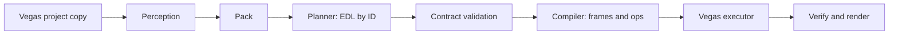

# Local AI Video Editing Agent for VEGAS Pro 17

**Status:** Design baseline plus Milestone 0 contract layer. Nothing edits video yet.

This privacy-first project is designed for 4–15 minute talking-content videos. A self-hosted Qwen endpoint proposes an edit plan using word, speaker, gap, and catalog IDs. Deterministic code is intended to resolve all numbers before VEGAS receives operations. Milestone 0 establishes and validates those data formats; it contains no ASR, model client, compiler timing logic, or Vegas executor.

## Pipeline



The current milestone implements the contract and validation foundation only.

## Quick start

Install Python 3.11, then run:

```powershell
python tasks.py setup
python tasks.py lint
python tasks.py test
python tasks.py schemas
python tasks.py docs-check
```

Windows uses `tasks.py` directly; the Makefile is a thin wrapper for platforms with Make. `python tasks.py dry-run` and `python tasks.py eval` intentionally return code 2 because those pipelines are not implemented in Milestone 0.

See [Windows setup](docs/SETUP.md) and [security boundaries](docs/SECURITY.md).

## Hardware layout

- Editing laptop: VEGAS Pro 17 and, in later milestones, the orchestrator and WhisperX perception. The design baseline targets an RTX 3050 with 4 GB VRAM.
- Inference server: self-hosted Qwen with a multimodal projector behind `llama-server`, reached over Tailscale. The design baseline assumes a 16 GB GPU.
- Optional CPU workers: a Ryzen 9 5900X may handle diarization and analysis if configured later.

These are design targets, not benchmark results. No hardware workflow has been exercised in Milestone 0.

## Project status

The contract schemas and prose specifications are in [schemas/](schemas/) and [docs/contracts/](docs/contracts/). Current deferred work is listed in [ROADMAP.md](ROADMAP.md). Vegas-specific behavior remains `UNVERIFIED` in [VEGAS_NOTES.md](docs/VEGAS_NOTES.md).
