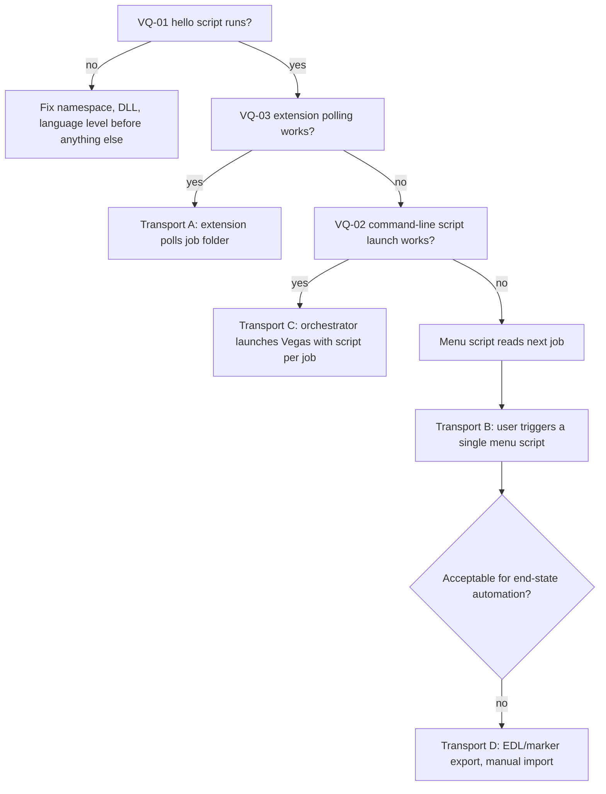
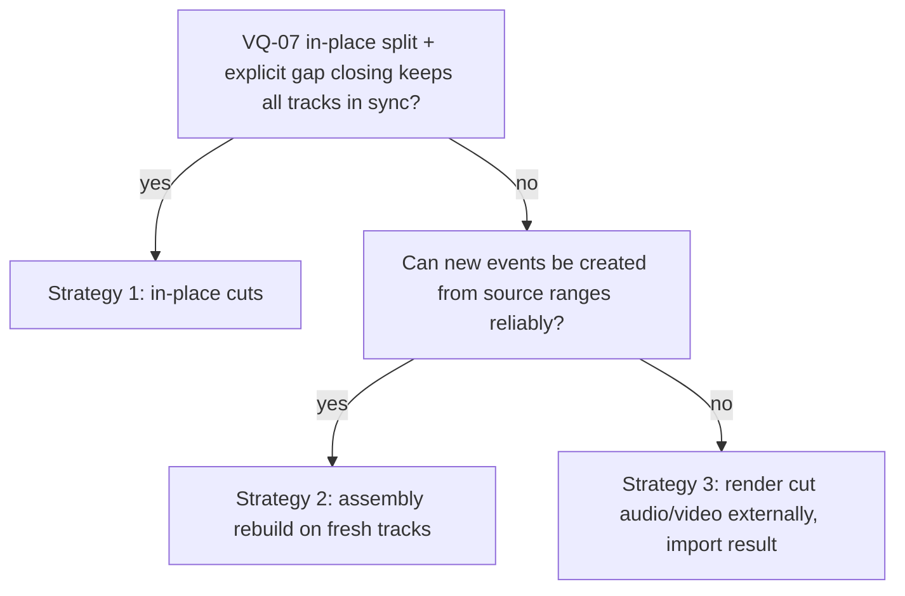
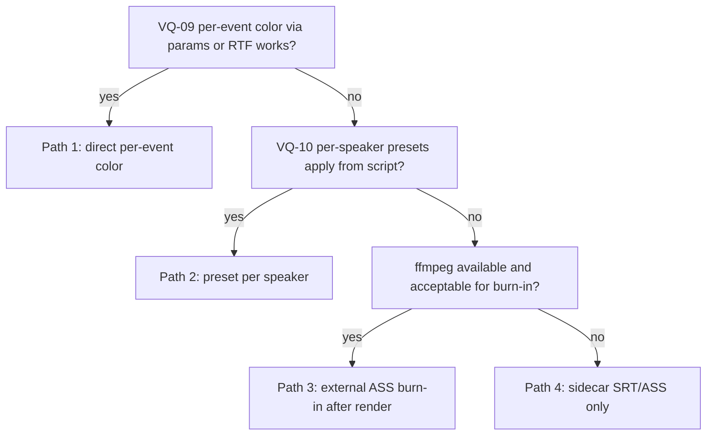

# VEGAS_NOTES.md

**Scope:** Everything this project knows, assumes, and still needs to prove about driving **VEGAS Pro 17** from code.
**Document version:** 1.0.3
**Companion to:** `ARCHITECTURE.md` (Sections 12, 13, 21)

This is a living lab notebook. Nothing in the executor, the compiler's Vegas-facing ops, or the subtitle path should depend on a Vegas behavior that is not marked `VERIFIED` here.

---

## Table of Contents

1. How to Use This Document
2. Evidence Levels and Status Legend
3. Environment Baseline (fill in first)
4. Established Facts (from sources)
5. API Surface Map
6. Open Questions Register (VQ-01 to VQ-20)
7. Known Pitfalls and Design Responses
8. Executor Operation to API Mapping
9. Decision Trees
10. Draft Probe Scripts (compiled, not run)
11. Test Project Corpus
12. Safety Protocol for Testing
13. Results Log
14. References and Leads
15. Change Log

---

## 1. How to Use This Document

1. Fill in Section 3 on the actual editing laptop before anything else.
2. Run the probe scripts in Section 10 and record outputs in Section 13.
3. Work through the Open Questions Register (Section 6) in the order given by Section 9's decision trees. Each question has a hypothesis, a test, a pass criterion, and a fallback.
4. When a question is settled, change its status, paste the evidence into the Results Log, and update `ARCHITECTURE.md` Section 21 if the outcome changes the design.
5. Never mark something `VERIFIED` from documentation alone. `VERIFIED` means it ran on this machine's Vegas 17 build and the result was observed.

---

## 2. Evidence Levels and Status Legend

### Evidence levels

| Level | Meaning |
| :-- | :-- |
| **E0** | Observed on this machine's Vegas 17 build in this project. The only level that counts as verified. |
| **E1** | Reported in community or official sources for a Vegas version close to 17 (14 to 16). Likely to hold, not proven. |
| **E2** | Reported for newer versions only (for example 21 or 22), or from a third-party summary. Weak evidence for 17. |
| **E3** | Recalled from general knowledge of the API shape. Names and signatures must be confirmed against the API summary and by compiling. |
| **EC (compile-time only)** | Type/member metadata read without loading executable code, or source compiled against the installed Vegas assembly. Confirms names and signatures only; it is not E0 and never proves runtime behavior. |

### Status values

| Status | Meaning |
| :-- | :-- |
| `UNVERIFIED` | No E0 evidence yet. |
| `VERIFIED` | E0 evidence recorded in Section 13. |
| `PARTIAL` | Works with limits. Limits are listed. |
| `PARTIAL (compile-time only)` | Metadata or source compilation confirms the API surface against this install, but runtime behavior remains unverified. |
| `DISPROVED` | Tested and does not work. Fallback is in force. |

All statuses in this document start at `UNVERIFIED` unless stated otherwise.

---

## 3. Environment Baseline (fill in first)

Record the real values. Many Vegas behaviors differ by build, OS, and plugins.

| Item | Value |
| :-- | :-- |
| VEGAS Pro version and build number (file metadata; Help > About not opened) | `17.0.0.284` |
| Install path | `VEGAS_INSTALL_DIR` from ignored local config; omitted from tracked docs |
| Windows version | Windows 10 build `19045` |
| .NET Framework versions installed | .NET Framework `4.8` |
| GPU and driver | NVIDIA GeForce RTX 3050 Ti Laptop GPU, 4 GB; driver `595.71` |
| GPU acceleration setting in Vegas (Preferences > Video) | Not inspected; Vegas was not launched |
| User Script Menu folder (`Documents\Vegas Script Menu`) | Not present at inspection time |
| Install-folder Script Menu present? | Yes |
| `Application Extensions` folder under install | Not found at install-folder root |
| Which DLL exists in the install folder: `ScriptPortal.Vegas.dll`, `Sony.Vegas.dll`, or both | `ScriptPortal.Vegas.dll` only; file and product version `17.0.0.284` |
| Third-party plugins installed (Sapphire, BorisFX, NewBlue, Vegasaur, and so on) | Not inventoried; requires Vegas/plugin inspection |
| Typical source formats (camera, OBS output container and codec) | Not established; media preflight unavailable without ffprobe |
| Typical project frame rates and resolutions | Not established |
| Typical audio layout (single mixed track vs per-speaker tracks) | Not established |
| Does Vegas 17 import the typical source files without conversion? | Not tested |

The VEGAS install-folder executable inventory was: `ApplicationRegistration.exe`, `CreateMinidumpx64.exe`, `ErrorReportClient.exe`, `ErrorReportLauncher.exe`, `NGenTool.exe`, `PRSConfig.exe`, `vegas170.exe`, and `vidcap60.exe`. The first four and `vegas170.exe` report Version 17.0 (Build 284); `NGenTool.exe` and `PRSConfig.exe` report `17.0.0.284`; `vidcap60.exe` reports version 6.0f (Build 1004). `vegas170.exe` is the executable name relevant to VQ-02.

Intake note: screen recorders and streaming software often write containers or codecs that older Vegas builds cannot import or decode cleanly (for example MKV, HEVC, or variable frame rate files). Check this early. If sources need a remux or transcode to a Vegas-friendly intermediate, that becomes a pipeline stage (see Section 7, pitfall P8).

---

## 4. Established Facts (from sources)

These come from the sources gathered during research. They are E1 or E2 and are listed so the team does not re-research them. Source URLs are in Section 14.

| # | Fact | Level | Notes |
| :-- | :-- | :-- | :-- |
| F1 | Scripting has existed since Vegas 4.0 and is supported in all Vegas Pro versions. It is not supported in Movie Studio editions. | E1 | Official scripting FAQ. |
| F2 | For Vegas Pro 14 and later, scripts use the namespace `ScriptPortal.Vegas`. Earlier scripts used `Sony.Vegas`. Third-party-branded "Sony" effects were renamed to "VEGAS". | E1 | Official FAQ and several community repos. |
| F3 | Conflicting statement exists: one community repo's readme says the `ScriptPortal.Vegas.dll` is for 13 and below and `Sony.Vegas.dll` for 14 and above, which contradicts the FAQ. | E1 (conflict) | Resolve by looking at what DLLs actually exist in the install folder (Section 3) and what compiles. Treat as VQ-01. |
| F4 | C# scripts begin with `using` lines and expose a public `FromVegas(Vegas vegas)` entry method. JavaScript scripts use `import` lines. | E1 | FAQ and many examples. |
| F5 | Scripts are placed in `Documents\Vegas Script Menu\` (or the install folder's Script Menu). Use Tools > Scripting > Rescan Script Menu Folder after adding or editing scripts. | E1 | FAQ. |
| F6 | Compiled script DLLs downloaded from the internet may be blocked by Windows and need to be unblocked in file properties before Vegas will load them. | E1 | Community wish-list thread. |
| F7 | `Vegas.Transitions` is an enumerable collection of `PlugInNode` objects exposing `Name`, `ClassID`, `UniqueID`, and `IsOFX`. A community script enumerated them on Vegas Pro 16 and wrote them to a text file. | E1 | Example output included entries such as "VEGAS Dissolve" with UID `{Svfx:com.sonycreativesoftware:dissolve}`. |
| F8 | Video effects are added to an event with `plugInNode = vegas.VideoFX.GetChildByUniqueID(uid)`, then `new Effect(plugInNode)`, then `videoEvent.Effects.Add(effect)`. | E1 | Several community posts (Vegas 16 to 22). |
| F9 | **Only OFX effects expose adjustable parameters through the scripting API.** Non-OFX effects can be added but not parameterized (a forum thread on "accessing non OFX effects via scripting" exists and has not been read yet). | E1 | Treat as a design constraint. See VQ-17. |
| F10 | `Effects.Clear()` and `Effects.Add/Insert` exist for event effect chains. Programmatic reordering of an existing effect chain was requested as a feature and may not exist. | E1/E3 | Do not rely on reordering. |
| F11 | Scripts can launch from the command line using a `-SCRIPT:"path"` argument, according to one third-party AI skill file written for Vegas 22. Not confirmed for 17. | E2 | VQ-02. |
| F12 | Community scripts exist that export regions to SRT or import SRT as regions and/or text events. | E1 | Reference only. Licenses not yet checked. See Section 14. |
| F13 | Community threads report that scripts which do heavy work can hang or freeze Vegas. | E1 | Reinforces the batching and heartbeat requirements (VQ-16). |
| F14 | Community extension threads exist (for example assigning a toolbar icon to an extension), which indicates an extension model exists in recent versions. | E2 | Supports the plausibility of transport option A. VQ-03 for 17. |
| F15 | Hidden "Internal" preferences are reachable by holding Shift while opening Tools > Preferences. Some transition defaults are stored there. | E1 | Potentially useful for defaults. Handle with care. |
| F16 | A script cannot rely on a one-argument parameter-passing mechanism by default. A forum thread on invoking scripts with parameters exists and has not been read yet. | E3 | VQ-02. |
| F17 | A silence-detector workflow that creates regions exists in a commercial add-on (Vegasaur) and in community scripts for selecting events within regions. | E1 | Not a dependency. Our silence analysis runs outside Vegas. |

---

## 5. API Surface Map

The executor and dumpers expect to use the following parts of the object model. Names are the best known; **every row is E3 unless a source is cited**, and must be confirmed by compiling against the real `ScriptPortal.Vegas.dll` (use a decompiler or the API summary page for the matching version).

| Area | Types / members expected | Used for | Evidence |
| :-- | :-- | :-- | :-- |
| Entry | `Vegas`, `FromVegas(Vegas vegas)` | Script entry | E1 (F4) |
| Project | `vegas.Project`, `Project.Tracks`, `Project.Markers`, `Project.Regions`, `Project.Video.FrameRate`, `Project.MediaPool`, `Project.FilePath` | Dump, markers, regions | E3 (some E1 from examples: `Project.Tracks`, `Project.Markers`, `Project.FilePath`) |
| Tracks | `Track`, `VideoTrack`, `AudioTrack`, `Track.Events`, `Track.IsAudio()`, `Track.IsVideo()`, `AddVideoEvent`, `AddAudioEvent` | Dump, add events | E3 |
| Events | `TrackEvent`, `VideoEvent`, `AudioEvent`, `Start`, `Length`, `End`, `Split`, `Selected`, `ActiveTake`, `Takes`, `Group` | Cuts, moves | E3 |
| Takes and media | `Take`, `Take.MediaPath`, `Take.Offset`, `Media`, `Media.Generator` | Media reference, text generator | E3 |
| Time | `Timecode`, `Timecode.FromMilliseconds`, `Timecode.FromFrames`, `ToMilliseconds()`, frame count member | Frame-accurate placement | E3 |
| Undo | `UndoBlock` (used in a `using` block) | Batch undo | E3 |
| Plugins | `vegas.Transitions`, `vegas.VideoFX`, `vegas.AudioFX`, `vegas.Generators`, `PlugInNode`, `GetChildByUniqueID`, `GetChildByName` | Catalog, apply FX | E1 for `Transitions`, `VideoFX`, `GetChildByUniqueID` (F7, F8); rest E3 |
| Effects | `Effect`, `Effects`, `Effects.Add`, `Effects.Clear`, `Effect.OFXEffect`, OFX parameter classes | Add/modify FX | E1 for `Effects.Add/Clear` (F8, F10); OFX parameter class names E3 |
| Fades and transitions | `FadeIn`, `FadeOut` members on events, a `Transition` property on a fade, curve types | Crossfades, video transitions | E3 |
| Envelopes | `Envelope`, `EnvelopePoint(s)`, `CurveType` | Gain, pan, opacity | E3 (the API index lists these types) |
| Markers | `Marker`, `Region`, `CommandMarker` | Dry run, subtitle spans | E3 |
| Render | `vegas.Render(...)`, `RenderArgs`, `RenderTemplate(s)`, `RenderStarted/Finished` events | Preview and final | E3 (F-wish-list mentions render events) |
| Project I/O | `vegas.SaveProject`, `vegas.OpenProject`, `vegas.NewProject` | Working copy | E3 |

The official Scripting API Summary page (newer version linked in Section 14) lists classes including AudioEvent, AudioTrack, Effect, Effects, Envelope, EnvelopePoint(s), PlugInNode, and Vegas, so the type families above are plausible. The M1 metadata inventory below records which names exist in this VEGAS 17 assembly; it does not establish runtime behavior.

### M1 metadata inventory (EC)

The full reflection-only type/member dump is in ignored output `runs/m1-vegas-metadata/ScriptPortal.Vegas.metadata.txt` (369 types and 6,695 declared-member entries in 7,064 total lines, including signatures, base types and interfaces). It was produced through .NET Framework reflection-only APIs. The table below is a condensed inventory for the members named in Sections 5 and 8. “Present” means the type/member name is in the installed assembly metadata; compile status is called out separately. This table does not establish that a Vegas operation works.

| API surface used/planned | Metadata inventory | Notes |
| :-- | :-- | :-- |
| `ScriptPortal.Vegas.Vegas`; script entry `FromVegas(Vegas)` | Present | The three probe sources compile with the namespace and entry signature. `FromVegas` is the script contract, not an assembly member. |
| `Project.FilePath`, `Tracks`, `Markers`, `Regions`, `MediaPool`, `Video`; `Project.Video.FrameRate` | Present | `FrameRate` is `Double`; this does not establish a rational frame-rate conversion. |
| `Track.Events`, `Name`, `Selected`, `IsAudio()`, `IsVideo()`; `VideoTrack.AddVideoEvent(Timecode, Timecode)`; `AudioTrack.AddAudioEvent(Timecode, Timecode)` | Present | `IsVideo`, event traversal, group and event-time members compile in `TimelineDump`; both event-add overloads are in metadata. |
| `TrackEvent.Start`, `Length`, `End`, `Split(Timecode)`, `Selected`, `ActiveTake`, `Takes`, `Group`, `FadeIn`, `FadeOut`, `RemoveSelf()` | Present | Names/signatures only; split, grouping and removal behavior are not tested. |
| `Take.MediaPath`, `Offset`; `Media(PlugInNode)`, `Media.Generator`, `GetVideoStreamByIndex(Int32)` | Present | `Take.Offset` has a setter in metadata. |
| `Timecode.FromMilliseconds(Double)`, `FromFrames(Int64)`, `ToMilliseconds()`, `FrameCount` | Present | `FromMilliseconds` and `ToMilliseconds` compile in `TimelineDump`; drift and project-rate behavior are untested. |
| `UndoBlock(String)`, `Dispose()` | Present | `TextProbe` compiles with an `UndoBlock` using block. Batch undo behavior is untested. |
| `Vegas.Transitions`, `VideoFX`, `AudioFX`, `Generators`; `PlugInNode.IsContainer`, enumeration, `Name`, `UniqueID`, `IsOFX`, `GetChildByUniqueID`, `GetChildByName` | Present | Recursive enumeration source compiles; no installed catalog was enumerated. |
| `Effect(PlugInNode)`, `Effects.AddEffect(PlugInNode)`, `Effects.Clear()`, `Effect.OFXEffect`, `OFXEffect.Parameters`, `OFXParameter.Name` | Present | Metadata confirms these members; no effect was added and no plugin parameter was read or changed. `Effects` also inherits a generic collection `Add`. |
| `Fade.Length`, `Curve`, `ReciprocalCurve`, `Transition`; `CurveType` | Present | `Fade.Transition` is typed as `System.Object`; applying a transition is unverified. |
| `Envelope`, `EnvelopePoint`, `Envelope.Points`, `EnvelopePoint(Timecode, Double, CurveType)` | Present | These names/signatures are in assembly metadata; envelope edits are unverified. |
| `Marker`, `Region`, `MarkerList`, `RegionList`, `Project.Markers`, `Project.Regions`, `Marker.RemoveSelf()` | Present | Marker/region types, constructors and collection interfaces are present. Collection mutation and prefix clearing remain untested. |
| `Vegas.Render(...)`, `RenderArgs`, `RenderTemplate(s)`, `Renderer.Templates`, `Vegas.RenderStarted/RenderFinished` | Present | `Vegas.Renderers` and `Renderer.Templates` lead to an enumerable `RenderTemplates` collection; no render or template enumeration was attempted. |
| `Vegas.SaveProject(...)`, `OpenProject(...)`, `NewProject()` | Present | These methods are on `Vegas`, not `Project`; save/open behavior is untested. |
| Extension and command-module surface | Present | `ICustomCommandModule`, `CustomCommand`, dock interfaces, and `DomainManager` load/add methods are present; the install root has no `Application Extensions` folder. See VQ-03. |
| Audio level, extension, time, fade, and render members | See EC follow-up below | Metadata names and types only; every runtime behavior remains unverified. |

### Prompt 01b metadata follow-up (EC only)

These entries are filtered from the existing reflection-only dump. They are compile-time metadata evidence, not runtime behavior or API guarantees.

**VQ-18 — gain, volume, level, normalization, mute, pan, and envelope names**

The following is the complete set of matching declared fields, methods, and properties on `AudioEvent`, `AudioTrack`, `TrackEvent`, and `Track` in the dump. The dump does not annotate visibility.

- **`AudioEvent`** — Properties: `Normalize:Boolean`, `NormalizeGain:Double`. Methods: `get_Normalize():Boolean`, `set_Normalize(Boolean):Void`, `get_NormalizeGain():Double`, `set_NormalizeGain(Double):Void`, `SetNormalize(Boolean, Double):Void`. No matching fields were listed.
- **`AudioTrack`** — Properties: `AutomatedPanX:Single`, `PanCenter:Single`, `PanX:Single`, `PanXAutomationState:AutomationControlAutomationState`, `PanXTouch:Boolean`, `PanY:Single`, `Volume:Single`. Methods: `CanAddEnvelope(EnvelopeType):Boolean`, `get_AutomatedPanX():Single`, `set_AutomatedPanX(Single):Void`, `get_PanCenter():Single`, `set_PanCenter(Single):Void`, `get_PanX():Single`, `set_PanX(Single):Void`, `get_PanXAutomationState():AutomationControlAutomationState`, `set_PanXTouch(Boolean):Void`, `get_PanY():Single`, `set_PanY(Single):Void`, `get_Volume():Single`, `set_Volume(Single):Void`. No matching fields were listed. `PanXAutomationState` has a getter but no matching setter in the dump; `PanXTouch` has a setter but no matching getter.
- **`TrackEvent`** — Property: `Mute:Boolean`. Methods: `get_Mute():Boolean`, `set_Mute(Boolean):Void`. No matching fields were listed.
- **`Track`** — Fields: `myEnvelopeCOM:IEnvelopeCOM`, `myEnvelopes:Envelopes`. Properties: `EnvelopeCOM:IEnvelopeCOM`, `Envelopes:Envelopes`, `Mute:Boolean`. Methods: `CanAddEnvelope(EnvelopeType):Boolean`, `get_EnvelopeCOM():IEnvelopeCOM`, `get_Envelopes():Envelopes`, `get_Mute():Boolean`, `set_Mute(Boolean):Void`.

`AudioEvent.Volume` and `TrackEvent.Volume` are absent from their declared metadata. The names suggest track-level SFX level could use `AudioTrack.Volume` or a track envelope; `AudioEvent.NormalizeGain` is also present, but its semantics are unknown. Metadata alone does not establish which setting produces the intended event gain.

**VQ-03 — extension model**

Matching type names are `AutomationControlAutomationState`, `CaptureDockWnd`, `CustomCommand`, `DockableControl`, `DockableControl+AppWindowClosingEventArgs`, `DockWindowStyle`, `DomainManager+DockWindowState`, `DomainManager+ToolbarMapping`, `ICustomCommandModule`, `IDockView`, `IDockWindow`, `OFXControlPoint`, `OFXControlPointType`, `TransportControl`, and `TransportControl+TransportSuspension`. No type name containing `Extension` or `UIClient` was found. `ICustomCommandModule` declares `GetCustomCommands():System.Collections.ICollection` and `InitializeModule(Vegas):Void`. Additional related metadata names include `DomainManager.AddCustomCommand(CustomCommand)`, `AddExtraCommandModule(String)`, and `LoadAppExtension(String, Boolean)`. This suggests an extension/custom-command route exists in the assembly metadata, but not that Vegas loads or runs one. The install root has no `Application Extensions` folder.

**VQ-11 — time and frame-rate members**

`Timecode` exposes `FrameCount:Int64`, `FrameRate:Double`, and `Nanos:Int64`. Frame/time constructors and factories include `.ctor(Project, Int64, Boolean)`, `.ctor(Double)`, `.ctor(String)`, `FromFrames(Int64):Timecode`, `FromSeconds(Double):Timecode`, `FromMilliseconds(Double):Timecode`, and `FromNanos(Int64):Timecode`. Formatting/parsing members include `FromPositionString(String):Timecode` and `FromPositionString(String, RulerFormat):Timecode`, `FromString(String):Timecode`, `FromString(String, RulerFormat):Timecode`, `FromString(String, RulerFormat, Boolean):Timecode`, `ToPositionString():String` and `ToPositionString(RulerFormat):String`, and `ToString(RulerFormat):String` and `ToString(RulerFormat, Boolean):String`. `VideoProperties.FrameRate` and `ProjectVideoProperties.FrameRate` are `Double`; the latter is readable and writable, and `ProjectVideoProperties` also exposes `PixelFormat`. Related project-aware factories are declared on `ProjectTimecode`: `FromFrames(Project, Int64):Timecode`, `FromMilliseconds(Project, Double):Timecode`, `FromNanos(Project, Int64):Timecode`, `FromPositionNanos(Project, Int64):Timecode`, `FromPositionString(Project, String):Timecode`, `FromPositionString(Project, String, RulerFormat):Timecode`, `FromSeconds(Project, Double):Timecode`, `FromString(Project, String):Timecode`, `FromString(Project, String, RulerFormat):Timecode`, and `FromString(Project, String, RulerFormat, Boolean):Timecode`. `RulerFormat` includes `TimeAndFrames`, `Smpte30`, `SmpteDrop`, `SmpteNonDrop`, `SmpteEBU`, `SmpteFilmSync`, and `SmpteFilmSyncIVTC`. The Boolean formatting overload semantics are not established by the metadata dump. No numerator/denominator frame-rate type or explicit drop-frame Boolean property was found on these inspected types; rational conversion and actual project-rate behavior remain unverified.

**VQ-05 / VQ-06 — fades and transitions**

`TrackEvent.FadeIn` and `FadeOut` are `Fade`. `Fade` exposes `Length: Timecode`, `Curve: CurveType`, `ReciprocalCurve: CurveType`, `Gain: Single`, and `Transition: System.Object`, plus setters, `SetCurve(CurveType, Int32)`, `GetCurve(Int32): CurveType`, and `RemoveTransition(): Boolean`. `CurveType` values are `Fast`, `Invalid`, `Linear`, `None`, `Sharp`, `Slow`, and `Smooth`. `Effect(PlugInNode)` and `Effects.AddEffect(PlugInNode): Void` are metadata hints for building/attaching effects; they do not explain the expected object assigned to `Fade.Transition` or prove a transition can be applied.

**VQ-14 — render arguments and templates**

`RenderArgs` has constructors `RenderArgs()` and `RenderArgs(Project)`. Its properties are `CancelRender:Boolean`, `GenerateLoudnessLog:Boolean`, `IncludeMarkers:Boolean`, `Length:Timecode`, `LengthNanos:Int64`, `OutputFile:String`, `OutputFileName:String`, `RendererID:UInt32`, `RenderTemplate:RenderTemplate`, `SaveAsMono:Boolean`, `SaveAsMonoStreams:Boolean`, `SaveProjectPathLink:Boolean`, `ShowOpenButtonsOnComplete:Boolean`, `Start:Timecode`, `StartNanos:Int64`, `Stereo3DModeOverride:Stereo3DOutputMode`, `StretchToFill:Boolean`, `TemplateID:UInt32`, `UseChannelMapping:Boolean`, `UseProjectRotation:Boolean`, `UseSelection:Boolean`, and `WaitForIdle:Boolean`. The dump has getters for all of those properties; setters are present except for `OutputFileName`, `RendererID`, and `TemplateID`. Its additional declared method is `GetTemplateCOM(IRenderTemplateCOM ByRef):Void`. The dump also lists backing/storage fields `myCancelRender:Boolean`, `myGenerateLoudnessLog:Boolean`, `myLengthTime:Int64`, `myOutputFile:String`, `myProject:Project`, `myRendererID:UInt32`, `myRenderTemplate:RenderTemplate`, `myS3DOverride:Stereo3DOutputMode`, `mySaveAsMono:Boolean`, `mySaveAsMonoStreams:Boolean`, `mySaveMarkers:Boolean`, `mySaveProjectPathLink:Boolean`, `myShowOpenButtonsOnComplete:Boolean`, `myStartTime:Int64`, `myStretchToFill:Boolean`, `myTemplateID:UInt32`, `myUseChannelMapping:Boolean`, `myUseProjectRotation:Boolean`, `myUseSelection:Boolean`, and `myWaitForIdle:Boolean`.

`RenderTemplate` has constructors `.ctor(IRendererCOM, UInt32, UInt32)`, `.ctor(UInt32, IRenderTemplateCOM)`, and `.ctor(IRendererCOM, UInt32, Byte[])`; all listed properties are getter-only in the dump. Its properties are `AudioBitrate:Int64`, `AudioBitsPerSample:Int32`, `AudioChannelCount:Int32`, `AudioChannelFlags:AudioChannelFlags`, `AudioSampleRate:UInt32`, `AudioStreamCount:Int32`, `COM:IRenderTemplateCOM`, `Description:String`, `FileExtensions:String[]`, `Index:Int32`, `Name:String`, `Notes:String`, `RendererID:UInt32`, `Supports360:Boolean`, `SupportsHDR10:Boolean`, `SupportsHLG:Boolean`, `SupportsStereoscopic:Boolean`, `TemplateGuid:Guid`, `TemplateID:UInt32`, `TotalBitrate:Int64`, `VideoBitrate:Int64`, `VideoDataRate:Int64`, `VideoFieldOrder:VideoFieldOrder`, `VideoFrameRate:Double`, `VideoHeight:Int32`, `VideoPixelAspectRatio:Double`, `VideoStreamCount:Int32`, and `VideoWidth:Int32`. Its declared methods are `GetAVInfo(FormatInfoList):Int32`, `GetBitrate(UInt32):Int64`, `GetStatusForContext(Int32, Boolean, Boolean, Boolean, Int32):RenderTemplateStatus`, `GetTemplateData():Byte[]`, `IsValid():Boolean`, `ReadTemplateStream(IStream, UInt32):Byte[]`, `ShowTemplateStatusWarning(RenderTemplateStatus, IntPtr):Void`, and `ToString():String`; the dump also includes fields `INVALID_ID:UInt32`, `myCOM:IRenderTemplateCOM`, `myDescription:String`, `myFileExtensions:String[]`, `myGuid:Guid`, `myGuidCached:Boolean`, `myName:String`, `myRendererID:UInt32`, and `myTemplateID:UInt32`. Metadata indicates template enumeration through `Vegas.Renderers`, `Renderer.Templates:RenderTemplates`, and the `RenderTemplates` collection (`IEnumerable`, `GetItem`, `Refresh`, `FindByName`, and `FindByGuid`). No installed template list was enumerated.

---

## 6. Open Questions Register

Format per question: **Why it matters, Hypothesis, Test, Pass criteria, Fallback, Status**.

Priority tags: **P0** blocks the executor, **P1** blocks a feature, **P2** quality or polish.

---

### VQ-01: Namespace, DLL reference, and compile target (P0)

- **Why:** Nothing compiles without the right reference. F3 shows conflicting claims.
- **Hypothesis:** Vegas Pro 17 uses `ScriptPortal.Vegas` (per the official FAQ). The compiled-script reference DLL lives in the Vegas install folder.
- **Test:**
  1. List the install folder for `*.Vegas.dll` and record names (Section 3).
  2. Compile and run a "hello" script via the Script Menu using `using ScriptPortal.Vegas;`. Show a `MessageBox` with `vegas.Version` if available, else the project path.
  3. Repeat with `Sony.Vegas` if the first fails.
  4. Determine the C# language level supported by the script compiler by testing a construct per line: string interpolation, `?.` operator, `var`, lambdas, `async/await`. Record what compiles.
  5. For compiled DLL scripts or extensions: determine the .NET Framework target Vegas 17 loads without error.
- **Pass:** Hello script runs. Language and framework limits recorded.
- **Fallback:** Use whichever namespace compiles. Write scripts in conservative C# (no interpolation, no null-conditional) until the level is known.
- **Status:** `PARTIAL (compile-time only)` — installed `ScriptPortal.Vegas.dll` version `17.0.0.284` was the reference; all three probes compile with `.NET Framework csc.exe /langversion:5`. The Vegas Script Menu/compiler and runtime remain untested.

---

### VQ-02: Invocation methods (P0)

- **Why:** Determines whether the pipeline can run hands-off.
- **Hypothesis:** Script menu works for sure. Command-line launch might work (F11, E2 only). Parameter passing may be limited (F16).
- **Test:**
  1. Run script from Tools > Scripting.
  2. Close Vegas. Run `vegas170.exe -SCRIPT:"<path>"` (confirm the real exe name in the install folder). Observe whether Vegas starts, runs the script, and what happens with an already-open instance.
  3. Test passing parameters: environment variables set before launch, a well-known job file path convention, and any documented mechanism in the forum thread on invoking scripts with parameters.
  4. Record whether a modal dialog or the serial/licensing prompt interferes with unattended launch (one forum report mentions a serial prompt on every run in a newer version).
- **Pass:** At least one launch path can start a job without clicking a menu.
- **Fallback:** User starts a single "Run Agent Job" menu script. That script reads the next job file. Still semi-manual but safe.
- **Status:** `UNVERIFIED`

---

### VQ-03: Extension model and UI-thread polling (P0 for full automation)

- **Why:** The preferred transport (Architecture 12.3, option A) is a Vegas extension that polls a job folder.
- **Hypothesis:** Vegas 17 supports "custom commands" or extension DLLs loaded at startup from an extensions folder, which can create a dockable control with a timer. Timer ticks fire on the UI thread, so Vegas API calls from them are safe if kept short.
- **Test:**
  1. Build a minimal extension (custom command or dockable control) per the SDK docs or the extension examples. Locate the extensions folder (Section 3).
  2. Add a `System.Windows.Forms.Timer` that every 1000 ms checks for a file and, if present, writes a response file.
  3. Confirm it runs while Vegas is idle and during playback.
  4. Confirm calling `vegas.Project` members from the timer tick works and does not throw cross-thread errors.
  5. Measure UI stall for a batch of N operations (N = 10, 100, 500).
- **Pass:** Polling works unattended, API calls from ticks succeed, stalls are acceptable at the chosen batch size.
- **Fallback:** Option B (menu script per job), or option D (EDL/marker export).
- **Status:** `UNVERIFIED`

---

### VQ-04: Catalog enumeration (P0)

- **Why:** The catalog is the model's closed vocabulary.
- **Hypothesis:** `vegas.Transitions`, `vegas.VideoFX`, `vegas.AudioFX`, and `vegas.Generators` are enumerable and may contain container nodes (folders) with children. Each leaf has `Name`, `UniqueID`, `IsOFX`. Plugin presets are accessible via an `EffectPresets` collection on a plugin node (the API index lists `EffectPreset` and `EffectPresets`).
- **Test:** Run `CatalogDump` (Section 10.1). Confirm: counts, whether containers exist and require recursion, whether third-party plugins appear, whether presets appear, and whether duplicate names exist (key collisions). Re-run after "Re-scan OFX plugins" (the Vegas menu action in the Plug-In Manager) and after toggling a plugin.
- **Pass:** JSON catalog with unique IDs for all transitions, video FX, audio FX, generators, and preset names for the text generator.
- **Fallback:** Maintain a hand-written catalog file that maps keys to unique IDs found by hand. Slower, but workable.
- **Status:** `PARTIAL (compile-time only)` — `CatalogDump` compiles against the plugin collection and `PlugInNode` members; plugin enumeration and catalog output remain untested.

---

### VQ-05: Applying video transitions and setting duration (P1)

- **Why:** "Great transitions" is a core requirement.
- **Hypothesis:** In Vegas a transition is expressed by overlapping two events on a track (or via a fade) and assigning a transition effect to the fade-in of the second event (or the fade-out of the first). The transition's length is the overlap or fade length. A forum thread titled roughly "apply transition on two closest events - script in C#" exists and is the first lead to read.
- **Test:**
  1. On a two-event video track with a small overlap, assign a known transition (for example the dissolve from F7) by `UniqueID`.
  2. Confirm it renders in preview.
  3. Change the overlap/fade length from script and confirm the change.
  4. Try a stylized OFX transition and check whether its parameters (if any) can be set (ties to VQ-17).
  5. Test transitions at a cut that was produced by `Split` + delete (no overlap). Determine how to create the overlap without shifting audio sync (slide the later event under the earlier, or extend handles).
- **Pass:** Transition applied by key, duration controlled by code, no A/V desync.
- **Fallback:** Restrict to dissolve/crossfade families and fade in/out. Apply stylized transitions only through saved presets.
- **Status:** `UNVERIFIED`

---

### VQ-06: Audio joins at cuts (P0)

- **Why:** Clean, click-free cuts are the heart of "extreme precision".
- **Hypothesis:** Audio events have fade-in/out with adjustable length and curve. A short fade (for example 10 to 30 ms) at each side of a cut prevents clicks. Overlapping audio events can crossfade.
- **Test:**
  1. Cut speech mid-silence and apply fades of 0, 5, 10, 20, 40 ms. Render and listen/analyze for clicks (use the verifier's discontinuity metric).
  2. Check how default fades behave on newly split events (Vegas can apply default fade lengths, which could silently alter your cuts).
  3. Confirm fade curve types available from script.
- **Pass:** A fade length and curve that eliminates clicks, set by code, with no unexpected default fades remaining.
- **Fallback:** Zero-crossing snapping in the compiler plus the shortest effective fade.
- **Status:** `UNVERIFIED`

---

### VQ-07: Split, delete, ripple, and groups (P0)

- **Why:** Core edit semantics. Wrong behavior desyncs A/V or breaks other tracks.
- **Hypothesis:** `TrackEvent.Split(Timecode)` returns the right-hand event. Removing an event does not ripple by itself. Ripple editing is a project/UI mode that may or may not apply to script calls, so the executor should perform explicit closing of gaps (moving later events left) rather than rely on ripple mode. Linked A/V events share a group, and splitting one linked event splits its group members (UI behavior), but script behavior must be checked.
- **Test:**
  1. On a project with linked A/V events plus an extra music track, split at a time T from script on the video event only. Check whether the linked audio also splits.
  2. Delete the middle piece. Check other tracks.
  3. Close the gap explicitly by moving all later events on all affected tracks left by the removed length. Confirm sync.
  4. Test with the project's ripple setting on and off. Record whether script operations are affected.
  5. Test locked tracks and events with keyframes (envelopes, pan/crop, FX keyframes). The RatinFX shorten/extend script notes explicitly that composite and FX keyframes do not move when event length changes via script (E1 hint).
- **Pass:** A deterministic algorithm (write it in Section 13) that removes a span from all tracks and keeps everything in sync, independent of the ripple setting.
- **Fallback:** Rebuild the timeline from kept segments instead of cutting in place: create new events from source ranges ("assembly edit") on fresh tracks, then mute/delete the originals. Slower but predictable.
- **Status:** `UNVERIFIED`

---

### VQ-08: UndoBlock behavior (P1)

- **Why:** The safety design wraps each batch in one undo step.
- **Hypothesis:** `using (UndoBlock u = new UndoBlock("Agent batch")) { ... }` groups edits, and one Ctrl+Z reverts the batch.
- **Test:** Run a batch of 50 mixed operations (split, delete, add marker, add text event, add transition). Press Undo once. Confirm everything reverts. Test an exception thrown mid-batch: confirm state is not left half-applied in a way that breaks the project.
- **Pass:** Single-step undo for complete batches. Failure behavior documented.
- **Fallback:** Rely on the working-copy rule (Section 12) and save checkpoints between batches.
- **Status:** `PARTIAL (compile-time only)` — `UndoBlock(String)` and `IDisposable.Dispose()` compile in `TextProbe`; undo grouping and rollback behavior remain untested.

---

### VQ-09: Text events: creation, content, and color (P0 for subtitles)

- **Why:** Speaker-colored subtitles inside Vegas depend on this.
- **Hypothesis:** The "Titles & Text" media generator can be instantiated from script (`new Media(generatorPlugIn)`), placed as a video event, and its parameters are reachable through the generator's OFX effect object. Text content is likely a string parameter that may hold **RTF**, in which case color can be set by writing RTF color tables and `\cf` codes. There may also be a separate color parameter. All of this is E3.
- **Test:**
  1. Run `TextProbe` (Section 10.3). Print every parameter name and its CLR type for the text generator.
  2. Set plain text through the text parameter. Render a frame.
  3. If the value is RTF, set `{\rtf1{\colortbl;\red255\green183\blue77;}\cf1 Hello}` and confirm color.
  4. If a color parameter exists, set it and confirm.
  5. Test two events on one track with different colors, plus line breaks and special characters (quotes, apostrophes, emoji, non-Latin).
  6. Measure time to create 300 text events (a 15-minute video can have several hundred captions) and the UI stall.
  7. Check how many video tracks / events this creates versus a single track with all captions.
- **Pass:** Per-event text and color set by code, reliably, at acceptable speed.
- **Fallback chain (Architecture 13.4):** saved preset per speaker color, then external ASS burn-in, then SRT/ASS sidecar only.
- **Status:** `PARTIAL (compile-time only)` — generator/media/event/OFX member names used by `TextProbe` compile against this assembly; no generator was instantiated and no text event or parameter was inspected at runtime.

---

### VQ-10: Preset-based speaker colors (P1)

- **Why:** Preferred fallback if per-event color is not scriptable.
- **Hypothesis:** The text generator has named presets (created by the user in the UI) that can be applied from script through `EffectPresets`. One preset per speaker color (and a few shared style settings such as font, outline, and position).
- **Test:** Create presets manually. Enumerate them from script. Apply by name to a new text event. Confirm text can still be changed after the preset is applied, and that the preset color persists.
- **Pass:** Preset applies, text editable, color retained.
- **Fallback:** ASS burn-in via ffmpeg after render.
- **Status:** `UNVERIFIED`

---

### VQ-11: Frame accuracy, NTSC rates, and timecode (P0)

- **Why:** Frame-snapped cuts require exact arithmetic. 29.97 and 59.94 are rational rates; floating point drifts.
- **Hypothesis:** `Project.Video.FrameRate` returns a double (for example 29.97002997...). `Timecode` supports frame-based construction. Drop-frame is a display convention and does not change the underlying frame grid.
- **Test:**
  1. Read the frame rate for projects at 23.976, 24, 25, 29.97, 30, 50, 59.94, 60.
  2. Compute frame N start time in milliseconds in code (exact rational) and compare with `Timecode.FromFrames(N).ToMilliseconds()` (or equivalents).
  3. Place events at frames 0, 1, 1000, 100000. Read back `Start` and compare. Record any rounding of the millisecond representation.
  4. Confirm whether splits land exactly on frame boundaries when given a frame-based timecode.
  5. Determine whether sample-accurate audio placement (sub-frame) is possible for audio events. If yes, audio cuts can use finer resolution than video frames.
- **Pass:** A documented conversion function from (rational fps, frame index) to the correct Vegas `Timecode`, with zero drift over 100,000 frames. A statement on audio sub-frame precision.
- **Fallback:** Always construct times from frame counts, never from floating seconds. Keep the project frame rate in the job as a rational string.
- **Status:** `PARTIAL (compile-time only)` — `Project.Video.FrameRate` is `Double`, and `Timecode.FromFrames`, `FromMilliseconds`, and `ToMilliseconds` are present; rational-rate mapping, frame placement and drift remain untested.

---

### VQ-12: Source media, takes, offsets, and VFR (P1)

- **Why:** Mapping source-media time (from ASR) to timeline time requires knowing event offsets and take mapping. Variable frame rate (VFR) footage can drift.
- **Hypothesis:** Each event has an `ActiveTake` with an `Offset` into the media. Timeline time = event.Start + (media time − take.Offset) for unstretched events. VFR footage may be conformed by Vegas to the project rate, shifting apparent sync over time.
- **Test:**
  1. Dump a project with trimmed events and confirm the mapping formula with ground truth on a clip with a visible/audible sync marker (a clapper or a beep).
  2. Import a known VFR clip. Compare ASR time (extracted audio) against audible position on the Vegas timeline at the start, middle, and end.
  3. Test events with playback rate changes (stretch) and determine whether the compiler must reject or handle them.
- **Pass:** Mapping formula validated. VFR drift measured. Rejection rules for stretched events defined.
- **Fallback:** Preflight stage: remux/transcode to constant frame rate before importing, then do all analysis on that file.
- **Status:** `UNVERIFIED`

---

### VQ-13: Markers and regions for dry runs (P1)

- **Why:** Dry-run mode shows planned cuts without editing.
- **Hypothesis:** Markers and regions can be added with labels. Marker colors may not be scriptable. Labels can encode category and cut id.
- **Test:** Add 200 markers and 100 regions from script with label prefixes (`CUT c1 retake 0.92`). Check labels, ordering, and the performance of adding many. Confirm they can be cleared by a label prefix after review.
- **Pass:** Reliable add and remove-by-prefix.
- **Fallback:** Write an external `markers.csv`/EDL for manual import.
- **Status:** `UNVERIFIED`

---

### VQ-14: Rendering from script (P1)

- **Why:** The verifier needs preview renders, and the pipeline needs the final render.
- **Hypothesis:** A script can render a region/time range using a named render template. Render events exist. A low-resolution template (for example a 480p proxy) renders fast for verification.
- **Test:**
  1. Enumerate render templates and their names.
  2. Render a 10-second range to a file using a named template from script. Confirm it blocks until finished and returns a status.
  3. Render a range with a low-res template and compare speed.
  4. Confirm GPU-accelerated encoders (if used) behave in unattended runs.
  5. Verify audio-only render to WAV for analysis (loudness, click detection).
- **Pass:** Known template names for preview (video), analysis (audio WAV), and final.
- **Fallback:** User-configured render via UI with a documented naming convention. The orchestrator watches for the output file.
- **Status:** `UNVERIFIED`

---

### VQ-15: Project copy and save semantics (P0)

- **Why:** The safety rule is to work on a copy and never touch the original.
- **Hypothesis:** The orchestrator can copy the `.veg` file on disk, then Vegas opens that copy. Saving from script writes to the opened path unless a save-as is used.
- **Test:** Verify the file-copy workflow. Confirm script operations on the open copy never modify the original on disk. Test the "save checkpoint" and "save as" calls. Check the project's media references (relative vs absolute paths) survive copying to a different folder. Check autosave/backup file behavior.
- **Pass:** Original byte-identical after a full run (compare hashes). Copy opens with all media online.
- **Fallback:** Copy into the same folder with a suffix to keep relative paths valid.
- **Status:** `UNVERIFIED`

---

### VQ-16: Blocking, stalls, heartbeat, batch size (P0)

- **Why:** Scripts and extension ticks run on the UI thread. Stalls make Vegas look frozen and risk "not responding" kills. Community reports of hangs (F13) reinforce this.
- **Test:** Measure per-operation cost for each op type at scale. Find the largest batch that keeps the UI responsive (target under a few hundred ms per tick). Implement a heartbeat file updated between batches. Test behavior when the user clicks in Vegas during execution.
- **Pass:** Documented batch size per op type and a working heartbeat.
- **Fallback:** Smaller batches, yield to the message loop between batches (for example `Application.DoEvents()` with care), or rebuild approach (VQ-07 fallback).
- **Status:** `UNVERIFIED`

---

### VQ-17: OFX parameter access (audio and video FX) (P1)

- **Why:** Determines what effects the catalog can include beyond "add with defaults".
- **Hypothesis:** OFX effects expose a parameters collection with typed parameter objects (double, int, boolean, choice, string, RGBA, and so on) that can be read and set, optionally with keyframes. Non-OFX effects do not (F9). There is a forum thread on changing audio effect parameters, to be read.
- **Test:** For three video OFX effects and two audio effects, dump all parameters (name, type, default, range) and set one of each type. Test keyframe creation if exposed. Test a non-OFX legacy effect to confirm the limitation.
- **Pass:** A list of which effects are "parameterizable" and which are "default or preset only". The catalog marks each with `params: {}` accordingly.
- **Fallback:** Catalog restricted to default-only or preset-only effects.
- **Status:** `UNVERIFIED`

---

### VQ-18: SFX insertion and gain (P1)

- **Why:** Sound effects need exact placement and level.
- **Test:** Add audio events from WAV files at frame-accurate positions on a dedicated SFX track. Set event gain/volume, fade in/out, and pan from script. Confirm normalization, loudness, and sample-rate mismatch handling (44.1 vs 48 kHz). Confirm track creation by name and reuse.
- **Pass:** Placement and gain set by code with measured offset error under one frame.
- **Fallback:** Pre-render the SFX bed in the orchestrator (ffmpeg mixing) as one audio file and import a single event.
- **Status:** `UNVERIFIED`

---

### VQ-19: Abort and stop behavior (P1)

- **Why:** The emergency-stop requirement.
- **Test:** Place a stop-file check between batches. Test aborting a long render. Test what happens if Vegas is closed during a batch (the working copy must remain valid; recover from the last checkpoint).
- **Pass:** Stop honored within one batch. Recovery procedure documented.
- **Status:** `UNVERIFIED`

---

### VQ-20: Licensing, security prompts, and Windows friction (P2)

- **Why:** Unattended runs break on prompts.
- **Test:** Check for licensing/sign-in prompts at launch, script-security warnings, blocked-DLL behavior (F6), antivirus quarantine of unsigned DLLs, and Windows Defender SmartScreen behavior on new binaries.
- **Pass:** A written "first-run checklist" in `docs/SETUP.md`.
- **Status:** `UNVERIFIED`

---

## 7. Known Pitfalls and Design Responses

| # | Pitfall | Cause | Design response |
| :-- | :-- | :-- | :-- |
| P1 | Linked audio/video desync | Cutting one member of a group | Compiler includes all group members; executor processes groups as a unit; tests in VQ-07 |
| P2 | Gaps or desync on other tracks after a cut | Ripple not applied to all tracks from script | Explicit gap closing across all tracks, or assembly-edit rebuild (VQ-07 fallback) |
| P3 | Keyframes (FX, composite, pan/crop, envelopes) not following trimmed events | Script length changes do not move keyframes (hint from a community script's notes) | Prefer rebuild or re-key after edits; reject projects with heavy keyframing in v1; warn in compile report |
| P4 | Unexpected default fades on new events | Vegas default fade settings | Explicitly set fades on every created or split event, and verify (VQ-06) |
| P5 | Clicks at joins | Cut not at zero-crossing, no fade | Zero-crossing snap, short fades, verifier click metric |
| P6 | Cumulative float drift | Using seconds as doubles | Frame/sample integer math, rational fps (VQ-11) |
| P7 | Locked tracks reject edits | Track lock | Preflight check; report instead of silently skipping |
| P8 | Unsupported or VFR source media | Old Vegas decoders, VFR conform | Preflight transcode/remux to CFR (VQ-12); media compatibility check at ingest |
| P9 | UI freeze | Long scripts on the UI thread | Batching, heartbeat, avoid long loops (VQ-16) |
| P10 | Catalog key collisions | Same display name for different plugins | Keys built from category plus normalized name plus short UID hash |
| P11 | Third-party plugin absent on another machine | Catalog tied to plugin list | `plugin_list_hash` in the catalog; EDLs referencing missing keys are rejected |
| P12 | Text generator differences by version | "VEGAS Titles & Text" naming and parameters changed over versions | Probe per install (VQ-09); never hard-code across versions |
| P13 | Stretched/time-remapped events | Playback-rate envelopes or stretch | Compiler rejects or handles explicitly; flagged in preflight |
| P14 | Nested projects, compound clips | Complicates event timing | Out of scope for v1; reject in preflight |
| P15 | Autosave/backup files confusing state | Vegas background saves | Work in a dedicated working directory; ignore `.bak`/autosave artifacts |
| P16 | Modal dialogs blocking script | Warnings (missing media, plugin prompts) | Preflight checks; configure Vegas to suppress optional dialogs where possible |
| P17 | Windows blocks downloaded DLLs | Mark-of-the-web (F6) | Setup guide step: unblock DLLs |
| P18 | Script language level too old for modern syntax | Script compiler limits | Conservative C# until VQ-01 settles; compile extension DLLs externally with a known target |

---

## 8. Executor Operation to API Mapping

This table is the contract between `ops.json` operation types and Vegas API behavior. **All rows are planned, not proven.**

| Op | Intended behavior | Vegas mechanism (E3 unless noted) | Depends on | Status |
| :-- | :-- | :-- | :-- | :-- |
| `add_marker` | Add labeled marker at frame | `Project.Markers.Add(new Marker(timecode, label))` | VQ-13 | UNVERIFIED |
| `add_region` | Add labeled region | `Project.Regions.Add(new Region(start, length, label))` | VQ-13 | UNVERIFIED |
| `split` | Split events at a frame, on listed tracks/groups | `TrackEvent.Split(timecode)` | VQ-07, VQ-11 | UNVERIFIED |
| `delete_range` | Remove material between two frames on listed tracks | split at both ends, remove middle events | VQ-07 | UNVERIFIED |
| `close_gap` | Shift later events left by length L on listed tracks | set `Start` on later events in order | VQ-07 | UNVERIFIED |
| `trim` | Change event start/length | `Start`/`Length`/take offset adjust | VQ-07, VQ-12 | UNVERIFIED |
| `set_fade` | Set fade-in/out length and curve on event | event fade objects | VQ-06 | UNVERIFIED |
| `add_transition` | Apply catalog transition between events | assign transition effect on fade; manage overlap | VQ-05 | UNVERIFIED |
| `add_audio_event` | Place SFX file with gain | `AudioTrack.AddAudioEvent`, take from `Media` | VQ-18 | UNVERIFIED |
| `set_gain` | Set SFX or track gain | track volume or envelope candidate; no event Volume member found | VQ-18 | UNVERIFIED |
| `apply_fx` | Add catalog FX with optional params | `GetChildByUniqueID` + `new Effect(...)` + `Effects.AddEffect(PlugInNode)` | VQ-04, VQ-17 | UNVERIFIED; inherited collection `Add` remains an alternative in metadata |
| `add_text_event` | Create caption event with text | text generator media + event | VQ-09 | UNVERIFIED |
| `set_text_style` | Apply speaker color/preset | RTF/param or preset | VQ-09, VQ-10 | UNVERIFIED |
| `render_preview` | Low-res or audio-only render of a range | render API with template | VQ-14 | UNVERIFIED |
| `render_final` | Final output | render API with template | VQ-14 | UNVERIFIED |
| `save_checkpoint` | Save project copy | `Vegas.SaveProject(...)` | VQ-15 | UNVERIFIED |
| `clear_markers_by_prefix` | Remove agent markers | iterate and remove | VQ-13 | UNVERIFIED |

### Prompt 01b metadata follow-up summary (EC only)

| Operation/design area | Metadata-only mechanism hints | Status |
|---|---|---|
| `add_audio_event` / `set_gain` (VQ-18) | `AudioTrack.AddAudioEvent` exists; `AudioTrack.Volume:Single`, `Track.Envelopes`, and `AudioEvent.NormalizeGain:Double` exist; `AudioEvent.Volume` and `TrackEvent.Volume` are absent. | UNVERIFIED; level-setting semantics were not exercised. |
| `apply_fx` (VQ-04, VQ-17) | `Effects.AddEffect(PlugInNode):Effect` is declared; inherited `BaseList<Effect>.Add(Effect):Void` and `Add(Object):Int32` are also present. Prefer the named `AddEffect` API in the first executor implementation. | UNVERIFIED; neither path was invoked. |
| `add_transition` (VQ-05) | `TrackEvent.FadeIn/FadeOut`, `Fade.Transition:System.Object`, `Effect(PlugInNode)`, and `Effects.AddEffect(PlugInNode)` exist. | UNVERIFIED; transition object and behavior are unknown. |
| frame resolution (VQ-11) | `Timecode.FrameCount:Int64`; exposed frame rates are `Double`; no rational numerator/denominator member was found on the inspected types. | UNVERIFIED; exact conversion remains open. |
| `render_preview` / `render_final` (VQ-14) | `RenderArgs`, `Vegas.Renderers`, and `Renderer.Templates:RenderTemplates` are present; the collection is enumerable in metadata. | UNVERIFIED; no template was enumerated and no render was attempted. |
| `save_checkpoint` (VQ-15) | `SaveProject(...)` is a method on `Vegas`; metadata does not place it on `Project`. | UNVERIFIED; save behavior was not exercised. |
| Executor extension route (VQ-03) | `ICustomCommandModule`, `CustomCommand`, dock interfaces, and `DomainManager` add/load methods exist; no `Application Extensions` folder was found at the install root. | UNVERIFIED; metadata suggests a route but does not establish host discovery or loading. |

Executor rules that hold regardless of test outcomes: refuse any path outside the declared working directory, never delete source media, reject unknown op types, wrap batches in undo blocks if VQ-08 passes, and check the stop file between batches.

---

## 9. Decision Trees

### 9.1 Transport selection (Architecture 12.3)



### 9.2 Edit strategy selection



### 9.3 Subtitle path selection (Architecture 13.4)



### 9.4 Catalog scope

```mermaid
flowchart TD
    A[VQ-17 which FX are parameterizable] --> B[Tag each catalog entry: params | preset_only | defaults_only]
    B --> C[Planner may set params only where tagged params]
```

---

## 10. Draft Probe Scripts (compiled, not run)

> **The code below has not been run in VEGAS.** All three source files compile against the installed Vegas assembly with the .NET Framework compiler in C# 5 mode. This confirms only the referenced member names/signatures; the Vegas Script Menu compiler and runtime remain untested. Run these on a **throwaway project**, never on real work.
>
> Output goes to `Documents\VegasAgent\probes\` so results are easy to paste into Section 13.

### 10.1 `CatalogDump.cs` (VQ-04)

```csharp
using System;
using System.IO;
using System.Text;
using System.Windows.Forms;
using ScriptPortal.Vegas;   // change to Sony.Vegas only if VQ-01 shows it is required

public class EntryPoint
{
    StringBuilder sb = new StringBuilder();

    static string Esc(string s)
    {
        if (s == null) return "";
        return s.Replace("\\", "\\\\").Replace("\"", "\\\"").Replace("\r", " ").Replace("\n", " ");
    }

    void Walk(PlugInNode node, string category, int depth)
    {
        // Containers (folders) may hold children. Leaves are real plugins.
        // IsContainer / enumeration behavior is unverified; adjust if it throws.
        bool container = false;
        try { container = node.IsContainer; } catch { }

        if (container)
        {
            foreach (PlugInNode child in node)
            {
                Walk(child, category, depth + 1);
            }
        }
        else
        {
            sb.Append("    {\"category\":\"").Append(category).Append("\",");
            sb.Append("\"name\":\"").Append(Esc(node.Name)).Append("\",");
            sb.Append("\"unique_id\":\"").Append(Esc(node.UniqueID)).Append("\",");
            sb.Append("\"is_ofx\":").Append(node.IsOFX ? "true" : "false").Append(",");
            sb.Append("\"depth\":").Append(depth).Append("},\r\n");
        }
    }

    public void FromVegas(Vegas vegas)
    {
        try
        {
            string dir = Path.Combine(
                Environment.GetFolderPath(Environment.SpecialFolder.MyDocuments),
                "VegasAgent\\probes");
            Directory.CreateDirectory(dir);

            sb.Append("{\r\n  \"plugins\": [\r\n");
            foreach (PlugInNode n in vegas.Transitions) Walk(n, "transition", 0);
            foreach (PlugInNode n in vegas.VideoFX)     Walk(n, "video_fx", 0);
            foreach (PlugInNode n in vegas.AudioFX)     Walk(n, "audio_fx", 0);
            foreach (PlugInNode n in vegas.Generators)  Walk(n, "generator", 0);
            sb.Append("    {}\r\n  ]\r\n}\r\n");   // trailing {} keeps the JSON valid after trailing commas

            string path = Path.Combine(dir, "catalog_dump.json");
            File.WriteAllText(path, sb.ToString(), Encoding.UTF8);
            MessageBox.Show("Wrote " + path);
        }
        catch (Exception e)
        {
            MessageBox.Show("CatalogDump failed: " + e.ToString());
        }
    }
}
```

Things to record: whether each of the four collections compiled, whether `IsContainer` and enumeration of a node worked, counts per category, whether third-party plugins appear, and any exception text.

### 10.2 `TimelineDump.cs` (VQ-07, VQ-11, VQ-12)

```csharp
using System;
using System.IO;
using System.Text;
using System.Windows.Forms;
using ScriptPortal.Vegas;

public class EntryPoint
{
    static string Esc(string s)
    {
        if (s == null) return "";
        return s.Replace("\\", "\\\\").Replace("\"", "\\\"").Replace("\r", " ").Replace("\n", " ");
    }

    public void FromVegas(Vegas vegas)
    {
        try
        {
            string dir = Path.Combine(
                Environment.GetFolderPath(Environment.SpecialFolder.MyDocuments),
                "VegasAgent\\probes");
            Directory.CreateDirectory(dir);

            StringBuilder sb = new StringBuilder();
            sb.Append("{\r\n");
            sb.Append("  \"project_path\": \"").Append(Esc(vegas.Project.FilePath)).Append("\",\r\n");
            // FrameRate is a double; the true rational rate must be inferred (VQ-11).
            sb.Append("  \"fps_double\": ").Append(vegas.Project.Video.FrameRate.ToString("R")).Append(",\r\n");
            sb.Append("  \"tracks\": [\r\n");

            int ti = 0;
            foreach (Track track in vegas.Project.Tracks)
            {
                sb.Append("    {\"index\":").Append(ti)
                  .Append(",\"kind\":\"").Append(track.IsVideo() ? "video" : "audio").Append("\"")
                  .Append(",\"name\":\"").Append(Esc(track.Name)).Append("\"")
                  .Append(",\"events\":[\r\n");

                int ei = 0;
                foreach (TrackEvent ev in track.Events)
                {
                    string media = "";
                    double offsetMs = 0;
                    try
                    {
                        if (ev.ActiveTake != null)
                        {
                            media = ev.ActiveTake.MediaPath;
                            offsetMs = ev.ActiveTake.Offset.ToMilliseconds();
                        }
                    }
                    catch { }

                    bool grouped = false;
                    try { grouped = (ev.Group != null); } catch { }

                    sb.Append("      {\"i\":").Append(ei)
                      .Append(",\"start_ms\":").Append(ev.Start.ToMilliseconds().ToString("R"))
                      .Append(",\"length_ms\":").Append(ev.Length.ToMilliseconds().ToString("R"))
                      .Append(",\"take_offset_ms\":").Append(offsetMs.ToString("R"))
                      .Append(",\"grouped\":").Append(grouped ? "true" : "false")
                      .Append(",\"media\":\"").Append(Esc(media)).Append("\"},\r\n");
                    ei++;
                }
                sb.Append("      {}\r\n    ]},\r\n");
                ti++;
            }
            sb.Append("    {}\r\n  ]\r\n}\r\n");

            string path = Path.Combine(dir, "timeline_dump.json");
            File.WriteAllText(path, sb.ToString(), Encoding.UTF8);
            MessageBox.Show("Wrote " + path);
        }
        catch (Exception e)
        {
            MessageBox.Show("TimelineDump failed: " + e.ToString());
        }
    }
}
```

Things to record: which members compiled, exact frame rate reported for each test project rate, whether `Group` exists and what it contains, millisecond precision of `Start`, and whether media paths are absolute.

### 10.3 `TextProbe.cs` (VQ-09)

```csharp
using System;
using System.Text;
using System.Windows.Forms;
using ScriptPortal.Vegas;

public class EntryPoint
{
    public void FromVegas(Vegas vegas)
    {
        try
        {
            // Find the text generator by name fragment; the exact name varies by version (pitfall P12).
            PlugInNode textPlug = null;
            foreach (PlugInNode n in vegas.Generators)
            {
                if (n.Name != null && n.Name.IndexOf("Titles", StringComparison.OrdinalIgnoreCase) >= 0)
                {
                    textPlug = n;
                    break;
                }
            }
            if (textPlug == null) { MessageBox.Show("No Titles generator found"); return; }

            Media media = new Media(textPlug);

            // Place one text event on the first video track at 0 for 2 seconds.
            VideoTrack vt = null;
            foreach (Track t in vegas.Project.Tracks)
            {
                if (t.IsVideo()) { vt = (VideoTrack)t; break; }
            }
            if (vt == null) { MessageBox.Show("Need at least one video track"); return; }

            using (UndoBlock undo = new UndoBlock("TextProbe"))
            {
                VideoEvent ev = vt.AddVideoEvent(Timecode.FromMilliseconds(0), Timecode.FromMilliseconds(2000));
                ev.AddTake(media.GetVideoStreamByIndex(0));

                // Dump parameters of the generator effect. Member names are unverified.
                StringBuilder sb = new StringBuilder();
                sb.AppendLine("Generator: " + textPlug.Name + "  UID=" + textPlug.UniqueID);
                Effect gen = media.Generator;
                OFXEffect ofx = gen.OFXEffect;
                foreach (OFXParameter p in ofx.Parameters)
                {
                    sb.AppendLine(p.Name + "  |  " + p.GetType().Name);
                }
                MessageBox.Show(sb.ToString());
            }
        }
        catch (Exception e)
        {
            MessageBox.Show("TextProbe failed: " + e.ToString());
        }
    }
}
```

Things to record: whether the generator is OFX-backed, the full parameter list with types, whether the text parameter is a plain string or RTF (print its current value), whether any color parameter exists, and what undo does to the added event.

### 10.4 Planned follow-up probes (not yet drafted)

- `SplitDeleteProbe` for VQ-07 (linked A/V, extra tracks, gap closing)
- `FadeProbe` for VQ-06
- `TransitionProbe` for VQ-05
- `RenderProbe` for VQ-14
- `FrameMathProbe` for VQ-11
- `BatchTimingProbe` for VQ-16
- `PresetProbe` for VQ-10

Each follows the same pattern: throwaway project, output to `probes/`, results pasted into Section 13.

---

## 11. Test Project Corpus

Create these small `.veg` projects once, keep them in `tests/executor/projects/`, and re-run the probes against them after any Vegas update.

| ID | Contents | Purpose |
| :-- | :-- | :-- |
| TP-01 | One video+audio clip, linked, 30 s, CFR 29.97 | Baseline split/delete/gap closing |
| TP-02 | Same plus a music track and an SFX track | Cross-track sync after cuts |
| TP-03 | Two overlapping video events | Transition application |
| TP-04 | Per-speaker audio tracks (two mics) plus a mixed camera track | Multitrack mapping |
| TP-05 | One mixed track with two speakers and some overlap | Diarization path |
| TP-06 | VFR clip (phone or screen recording) | Drift measurement |
| TP-07 | Events with envelopes, pan/crop keyframes, FX keyframes | Keyframe behavior (pitfall P3) |
| TP-08 | Locked track, muted track, and a stretched event | Preflight rejections |
| TP-09 | 23.976, 24, 25, 29.97, 30, 50, 59.94, 60 fps empty projects | Frame math |
| TP-10 | Clip with a clapper/beep at known frames | Sync ground truth |
| TP-11 | 15-minute talking-head with 300+ caption targets | Scale test for text events and batching |

Ground truth for each lives next to the project (`*.truth.json`): expected cut frames, expected speaker labels, expected caption text and times.

---

## 12. Safety Protocol for Testing

1. Probe scripts run only on projects inside `tests/executor/projects/` or a scratch folder. Never against a client or real project.
2. Keep a read-only golden copy of each test project. Reset before each run.
3. Record the hash of the original `.veg` and source media before a run. Compare after (VQ-15).
4. Do not run probes while Vegas has unsaved real work open in the same instance.
5. Save a checkpoint before any batch test that could hang Vegas.
6. When a probe crashes Vegas, record the build, the script, and the last log line in Section 13. Do not retry blindly.
7. Never run downloaded scripts without reading them. Community scripts are untrusted code (see `SECURITY.md`). They run with full user permissions inside Vegas.

---

## 13. Results Log

Append an entry for every test. Newest at the bottom. Compile-only checks use evidence label EC and must not be recorded as E0.

**Template**

```
### R-000 | VQ-xx | <short title>
Date: ____   Tester: ____   Vegas build: ____   OS: ____
Project: <TP id>
Script/steps: <file name or numbered steps>
Observed: <what happened, with numbers>
Evidence: <file path to dump/render/screenshot>
Conclusion: PASS | PARTIAL | FAIL
Status change: VQ-xx UNVERIFIED -> VERIFIED | PARTIAL | PARTIAL (compile-time only) | DISPROVED
Follow-ups: <items>
```

**Entries**

### R-001 | VQ-01, VQ-04, VQ-09, VQ-11 | Assembly inventory and reflection-only metadata
Date: 2026-10-06   Tester: Codex   Vegas build: 17.0.0.284   OS: Windows 10 build 19045
Project: none (metadata-only inspection)
Script/steps: Read `ScriptPortal.Vegas.dll` through .NET Framework reflection-only APIs; enumerate assembly types and declared members, signatures, base types and interfaces. No `Assembly.Load`, Vegas process, or probe execution.
Observed: `ScriptPortal.Vegas.dll` is the only `*.Vegas.dll` in the install folder; file and product versions are both `17.0.0.284`. `Sony.Vegas.dll` is absent. `vegas170.exe` exists and reports Version 17.0 (Build 284). The install root contains a `Script Menu` folder but no `Application Extensions` folder; the user Documents Script Menu folder was not present at inspection time. Metadata contains 369 types and 6,695 declared-member entries (7,064 total lines).
Evidence: ignored `runs/m1-vegas-metadata/ScriptPortal.Vegas.metadata.txt`; executable and DLL inventory recorded in Section 3.
Conclusion: PARTIAL (compile-time only)
Status change: VQ-01 UNVERIFIED -> PARTIAL (compile-time only); no runtime status changes.
Follow-ups: Use `docs/HUMAN_TESTS_M1.md` to test Script Menu loading, command-line invocation, extension feasibility, and runtime behavior on a disposable project.

### R-002 | VQ-01, VQ-04, VQ-08, VQ-09, VQ-11 | Probe compile-only check
Date: 2026-10-06   Tester: Codex   Vegas build: 17.0.0.284   OS: Windows 10 build 19045
Project: none
Script/steps: For each existing source, compile with `.NET Framework csc.exe /nologo /langversion:5 /target:library`, reference `ScriptPortal.Vegas.dll` and `System.Windows.Forms.dll`: `CatalogDump.cs`, `TimelineDump.cs`, and `TextProbe.cs`.
Observed: All three compiler invocations exited 0 with no diagnostics. C# language mode was explicitly set to 5. The compiler banner identifies Microsoft C# compiler 4.8.9232.0 and states it supports through C# 5; a separate `/version` query is not a supported switch. No source probe was edited or executed.
Evidence: ignored outputs `runs/m1-vegas-metadata/compiled/CatalogDump.dll`, `TimelineDump.dll`, and `TextProbe.dll`; source files remain in `vegas/probes/`.
Conclusion: PARTIAL (compile-time only)
Status change: VQ-01, VQ-04, VQ-08, VQ-09, and VQ-11 have compile-time evidence only; runtime behaviors remain UNVERIFIED.
Follow-ups: Complete `docs/HUMAN_TESTS_M1.md`; retain all Vegas behavior as unverified until observed on a throwaway project.

---

### R-003 | VQ-03, VQ-05, VQ-06, VQ-11, VQ-14, VQ-18 | Metadata follow-up
Date: 2026-10-06   Tester: Codex   Vegas build: 17.0.0.284   OS: Windows 10 build 19045
Project: none (metadata-only inspection)
Script/steps: Filter the existing reflection-only metadata dump by the requested type/member names. No assembly code was loaded or executed; Vegas was not launched; no probe source was changed.
Observed: Audio-event normalization members and track-level volume/pan/envelope members are present; direct event Volume is absent. Custom-command/dock types and an `ICustomCommandModule` interface are present. Timecode and project frame-rate properties use `Int64` frame count and `Double` frame rate, with no rational numerator/denominator property in the inspected types. Fade/transition and render/template metadata are summarized above.
Evidence: ignored `runs/m1-vegas-metadata/ScriptPortal.Vegas.metadata.txt`.
Conclusion: PARTIAL (compile-time only)
Status change: No Vegas question was marked VERIFIED. VQ-03, VQ-05, VQ-06, VQ-11, VQ-14, and VQ-18 remain UNVERIFIED for runtime behavior.
Follow-ups: Complete the corresponding checks on a throwaway Vegas project before implementing executor behavior.

---

## 14. References and Leads

### Sources used for the Established Facts (Section 4)

- Official scripting FAQ and resources thread on the VEGAS Creative Software forum: `https://www.vegascreativesoftware.info/us/forum/vegas-pro-scripting-faqs-resources--104563/`
- Official scripting API summary (newer version; verify against 17): `https://help.magix-hub.com/video/vegas/22/en/content/topics/external/vegasscriptapi.html`
- Transition enumeration example (Vegas 16 output): `https://www.vegascreativesoftware.info/us/forum/internal-transition-values--113307`
- Adding video FX and FX chains: `https://www.vegascreativesoftware.info/us/forum/adding-video-fx-fx-chains--135614`
- Applying an effect by unique ID in a script: `https://www.vegascreativesoftware.info/us/forum/automatic-script--146724`
- Scripting wish list (limits of the API): `https://www.vegascreativesoftware.info/us/forum/vegas-pro-scripting-api-wishes--104134`
- Scripting forum index (leads list): `https://www.vegascreativesoftware.info/us/vegas-pro-forum/scripting/`
- Silence-detection and event-selection discussion: `https://creativecow.net/?p=1099169`
- Third-party AI skill file describing command-line script execution (newer version, E2): `https://unpkg.com/major-ai-skills@2.3.0/skills/vegas-pro/SKILL.md`

### Community code to study (licenses not yet checked)

- `https://github.com/kaszarobert/vegas-regions-to-srt` (SRT import as regions/text events)
- `https://gist.github.com/behringer24/de3337547c49f90a6109f8313b8184b4` (regions to SRT export)
- `https://gist.github.com/SuperFromND/83fb9bc3c425b47bb1cebf848797601f` (regions to subtitles, SRT support)
- `https://github.com/evankale/VegasScripts` (various scripts and a common helper DLL, tested on v14)
- `https://github.com/RatinFX/ShortenExtendMedia` (note on keyframes not moving)

Before adapting any code from these, record the license in `DECISIONS.md`. When there is no license, treat the code as reference-only and write original implementations.

### Forum threads to read next (titles seen in the scripting index, not yet read)

1. "apply transition on two closest events - script in C#" (VQ-05)
2. "Accessing non OFX Effects via scripting" (VQ-17)
3. "How to change Audio Effect Parameter?" (VQ-17)
4. "Invoke script with parameters" (VQ-02)
5. "How to Import Two-line Subtitles into Vegas?" (VQ-09)
6. "Assign a toolbar icon to the Extension?" (VQ-03)
7. "SCRIPT HELP Envelope Point Creation and Opacity Issues" (VQ-18)
8. "Is the VEGAS Scripting API also updating with every new update?" (version differences, relevant to 17)

### Other leads

- Legacy Sony Vegas SDKs on the Internet Archive (referenced by the official FAQ). Much is described as still relevant to later versions and may include extension examples useful for VQ-03.
- A decompiler (for example ILSpy) pointed at the install folder's Vegas DLL is the authoritative way to confirm member names for 17 (VQ-01 and the whole API Surface Map).

---

## 15. Change Log

| Version | Date | Change |
| :-- | :-- | :-- |
| 1.0.0 | initial | First complete draft. All Vegas-specific behaviors `UNVERIFIED`. Probe scripts drafted but not run. |
| 1.0.1 | 2026-10-05 | Moved the source note to its canonical docs path; no Vegas behavior changed or was verified. |
| 1.0.2 | 2026-10-06 | Recorded VEGAS 17.0 build 284 install metadata and reflection-only member inventory; all three probes compile in C# 5 mode. Statuses remain partial compile-time only where applicable; no Vegas script or project was run. |
| 1.0.3 | 2026-10-06 | Added Prompt 01b metadata follow-ups for gain, extension, time/frame-rate, fades, render templates, and executor mechanism notes; corrected the R-003 placement. Metadata remains EC only. |

---

*End of VEGAS_NOTES.md v1.0.3*
